<!-- meta
date: 2026-07-12 21:30
slug: 27b-finetune-quality
title: Qwen3.6-27B fine-tune shootout — output quality + token economy (R9700)
takeaway: Same hybrid arch across 4 fine-tunes ⇒ quality/economy differ only by training. jackrong-qwopus is the efficient-frontier pick (100% det, judge 4.67, ~960 think tok); MTP gives 2.2× decode & 2.6× faster time-to-answer for ~1.7 GiB VRAM but caused one sampling-trajectory regression; hauhau runs away (2 empty answers at 8192-tok cap).
-->

# Benchmark: Qwen3.6-27B fine-tune shootout — output quality + token economy — R9700 (gfx1201)

- **Date:** 2026-07-12 21:30 · **Track:** engine-bench (custom quality/economy capture, not a tuning sweep)
- **GPU/Host:** AMD Radeon AI PRO R9700 (RDNA4, gfx1201, 32 GB / 32624 MiB) · Ryzen 5 3600 · Ubuntu 24.04 · ROCm 7.x · `HSA_OVERRIDE_GFX_VERSION=12.0.1`
- **Runtimes/builds:** llama.cpp **b9950-961e4b26a**, **Vulkan/RADV** backend (:8081) · served via `bench/engine-bench/serve_llamacpp.sh`
- **Models:** 4 community Qwen3.6-27B fine-tunes (all ~Q4 class, identical `qwen35` hybrid arch: 48 SSM/Gated-DeltaNet + 16 full-attn + 1 nextn/MTP), MTP build run both ways = **5 configs**
- **Data:** `campaigns/2026-07-12-27b-finetune-quality/out/` (`outputs.jsonl`, `vram.jsonl`, `scores_deterministic.jsonl`, `judge_scores.jsonl`, `gpu_<config>.csv`, `props_<config>.json`)

## Summary

All four fine-tunes share one architecture, so **every difference below is from training data, not capacity.** `jackrong-qwopus` is the standout all-rounder — **100% deterministic pass, judge 4.67/5, and it does it on ~960 mean think tokens** (2–3.5× leaner than the unsloth builds), giving the best quality-per-token of any accurate config. `unsloth-mtp-off` is the quality anchor (100% det, judge 4.78) but expensive: 2110 think tokens → **70 s to first answer token**. Turning **MTP on** (same weights) buys a **2.23× decode speedup (30→67 tok/s) and 2.6× faster time-to-answer (70→27 s)** for ~1.7 GiB extra VRAM and +71 W peak — but it flipped one deterministic task (code-fixbug) into an 8192-token runaway, dropping it to 89% (a sampling-trajectory divergence, not a capability loss). `rico03-distilled` reasons the least (607 think tok on hard tasks) and is fast, but is the **only config to fabricate content** on the open-ended technical question and fails on strict output formatting. `hauhau-uncensored` is the **rambler**: 4612 think tokens on headline tasks, worst economy (1.28 judge-pts/1k tok), and its two deterministic failures are both **token runaways** (hit the 8192 cap, produced *empty* answers) rather than wrong reasoning. **Caveat:** ctx was run at **132768** (not the planned 32768) — harmless to results but every config spilled ~0.8–1.5 GiB into GTT (host RAM); no freeze (peak VRAM ≤ 28.8 GiB < 32.6 GiB physical). Single rep at temp 1.0 → treat ±1 deterministic task as noise.

## Legend — knobs & labels used in this run

| Term | What it is | Effect on this box (R9700 / RDNA4, 32 GB) | How it's tested here |
|------|------------|-------------------------------------------|----------------------|
| MTP | multi-token prediction speculative decode (`--spec-type draft-mtp`; draft layer embedded in the GGUF) | **MEASURED 2.23× decode, 2.57× faster ttfa** on the unsloth build; +1.7 GiB VRAM, +71 W peak; one task regressed | on/off axis, same weights, same seed |
| `-fa` (flash attention) | fused attention kernel | on for all configs (required for the hybrid attn layers) | fixed |
| KV `f16` | 16-bit KV-cache entries | baseline; only the 16 full-attn layers cache KV (hybrid) → 64 KiB/tok | fixed for all configs |
| `think_tokens` | tokens spent inside `<think>…</think>` before the answer | **the headline economy metric** — spread 7.6× across fine-tunes for the same tasks | counted per response from the stream |
| `ttfa_s` (time-to-first-answer) | wall-clock to the first *answer* token (post-`</think>`) — what the user waits for | **MEASURED ≈ think_tokens ÷ decode_tps** — dominated by how much the model thinks | streamed, chat API |
| `ttft_s` | time to the very first token (start of thinking) | ~0.55–0.68 s, flat across configs (prefill of a <1K prompt) | streamed |
| runaway | `finish_reason=length` with `has_answer=False` — burned the whole 8192 budget thinking, no answer | a real inefficiency/failure mode; **the `truncated_thinking` flag missed all 3** (it closed `</think>` at the cap) | derived from finish_reason+has_answer |
| deterministic pass% | fraction of the 9 auto-graded tasks passed (strict `FINAL:`/code-block format) | objective, no judge | `graders/score_deterministic.py` |
| judge /5 | LLM-judge mean of correctness/depth/clarity on the 3 open-ended tasks, scored **blind** (shuffled+anonymized) | `INFERRED` (rubric saved below) | Claude, Phase B |
| quality/1k tok | judge score ÷ (mean completion tokens/1000) = judge points per 1k tokens generated | the token-economy efficiency number | derived |
| peak GTT MiB | host-RAM (GPU-accessible system RAM) spill; idle baseline ≈ 77 MiB on this box | **763–1493 MiB here — a modest spill, flagged**; no freeze (VRAM had headroom) | `vram_sampler.py` → `gpu_<config>.csv` |
| `Q4_K_M` / `Q4_K_S` / `IQ4_XS` | GGUF weight quant of each fine-tune | ~Q4 class, apples-to-apples; IQ4_XS vs Q4_K_M is a minor cross-repo confound | fixed per config |

## Results (headline — one row per config; memory columns mandatory)

All numbers `MEASURED` from `out/` unless tagged. Judge /5 is `INFERRED` (blind LLM-judge). ctx 132768, KV f16, `-ub 2048 -b 4096 -fa on`, np 1, temp 1.0/top_p 0.95/top_k 20/seed 42, max_tokens 8192, reps 1.

| config | mtp | det pass% | judge /5 | mean think tok | mean total tok | quality/1k tok | decode tok/s | prefill tok/s | ttfa s | ttft s | VRAM@load MiB | peak VRAM MiB | peak GTT MiB | avg W | peak W |
|--------|:---:|----------:|---------:|---------------:|---------------:|---------------:|-------------:|--------------:|-------:|-------:|--------------:|-------------:|------------:|------:|------:|
| **jackrong-qwopus** | off | **100** | 4.67 | **961** | 1403 | **3.33** | 31.0 | 222 | 31.7 | 0.56 | 25992 | 26165 | 763 | 296.5 | 329 |
| unsloth-mtp-off | off | **100** | 4.78 | 2110 | 2562 | 1.87 | 30.3 | 218 | 70.3 | 0.62 | 27005 | 27158 | 787 | 296.8 | 332 |
| unsloth-mtp-on | **on** | 89 | **4.89** | 2297 | 2748 | 1.78 | **67.5** | 190 | 27.4 | 0.68 | 28726 | 28830 | **1493** | 295.5 | **403** |
| rico03-distilled | off | 78 | 4.11 | **607** | 1109 | **3.71** | 32.5 | 218 | **21.2** | 0.55 | 25424 | 25686 | 776 | 295.1 | 341 |
| hauhau-uncensored | off | 78 | 4.78 | **4612** | 3720 | **1.28** | 30.8 | 203 | 77.0 | 0.67 | 25058 | 25214 | 798 | 298.2 | 348 |

(`mean think tok`/`ttfa`/`quality/1k` bolded at the extremes. All configs loaded and completed — **no FAILED/SKIPPED servers**, `failures.txt` empty.)

## Judge breakdown (blind, 0–5 per dimension, mean of 3 open-ended tasks)

| config | correctness | depth | clarity | mean | notes |
|--------|:-----------:|:-----:|:-------:|:----:|-------|
| unsloth-mtp-on | 5.0 | 5.0 | 4.7 | **4.89** | strongest technical answers; review-code + explain-hybrid both thorough |
| unsloth-mtp-off | 4.7 | 5.0 | 4.7 | 4.78 | same weights; the explain-hybrid answer visibly fumbled its KV arithmetic mid-text |
| hauhau-uncensored | 4.7 | 4.7 | 5.0 | 4.78 | clean, accurate, well-organized when it *does* answer (see runaways below) |
| jackrong-qwopus | 5.0 | 4.0 | 5.0 | 4.67 | accurate + concise; slightly fewer non-obvious insights (lower depth) — the efficiency trade |
| rico03-distilled | 4.3 | 3.7 | 4.3 | **4.11** | **only config to fabricate** empirical tables on explain-hybrid, and it leaked a raw `<thinking>` block into the answer |

Judge rubric (saved): correctness (factually right / catches the real issues), depth (completeness, non-obvious insight), clarity (organized, concise — padding penalized). Task anchors used: review-code required flagging `eval()` RCE + path-traversal via `name` + no-error-handling/unclosed-file (**all 5 caught all three**); explain-hybrid required "only full-attn layers grow the KV cache, SSM keeps fixed-size state" (all 5 stated it; differentiation was arithmetic accuracy + the recall trade-off); refactor-fn expected `is not None`, `str()`/f-string unification, `urllib.parse.urlencode`, clear naming.

## Token economy — the headline finding

Same tasks, same sampling, same architecture — **thinking effort varies 7.6×** on the ★ headline reasoning tasks (math-primes, logic-knights, explain-hybrid):

| config | ★ mean think tok | full-set mean think tok | mean answer tok | judge/1k tok |
|--------|-----------------:|------------------------:|----------------:|-------------:|
| rico03-distilled | **607** | 670 | 439 | 3.71 |
| jackrong-qwopus | 1330 | 961 | 442 | **3.33** |
| unsloth-mtp-on | 2715 | 2297 | 452 | 1.78 |
| unsloth-mtp-off | 2920 | 2110 | 451 | 1.87 |
| hauhau-uncensored | **4612** | 3322 | 398 | 1.28 |

**Answer length is nearly constant (~400–450 tok) — the entire economy difference is in the *thinking*.** rico03 and jackrong reach the same final answers as the unsloth/hauhau builds while spending a fraction of the reasoning budget. hauhau spends **4.8× more** thinking than jackrong for a *lower* effective quality-per-token, and its excess sometimes tips into runaway (below).

## MTP on/off (unsloth build, identical weights & seed)

| metric | mtp-off | mtp-on | Δ | provenance |
|--------|--------:|-------:|---|-----------|
| decode tok/s | 30.3 | 67.5 | **+123% (2.23×)** | MEASURED |
| prefill tok/s | 218 | 190 | −13% | MEASURED |
| ttfa s | 70.3 | 27.4 | **−61% (2.57× faster)** | MEASURED |
| det pass% | 100 | 89 | −1 task (code-fixbug runaway) | MEASURED |
| judge /5 | 4.78 | 4.89 | +0.11 (tie, n=3) | INFERRED |
| VRAM@load MiB | 27005 | 28726 | +1721 (~1.7 GiB draft layer) | MEASURED |
| peak GTT MiB | 787 | 1493 | +706 | MEASURED |
| peak power W | 332 | 403 | +71 | MEASURED |

MTP is a **large, real decode win** on this box — 2.2× tokens/s, and because time-to-first-answer is dominated by thinking (see root cause #1), it cuts the user-facing wait 2.6×. Cost: ~1.7 GiB VRAM for the draft layer, higher peak GTT/power, and a **correctness-variance risk** (one task diverged into an 8192-token runaway that mtp-off passed cleanly). `props` reports `speculative.types: "none"` in the per-request *defaults* block, but the 2.2× decode gap and `mtp:1` server flag confirm speculation was active — the field just doesn't reflect the server-level draft config.

## Truncation / runaway — and a flag bug

**3 genuine runaways** (`finish_reason=length` **and** `has_answer=False` — the model burned all 8192 tokens thinking and emitted no answer):

| config | task | think tok | answer | consequence |
|--------|------|----------:|:------:|-------------|
| hauhau-uncensored | math-primes | 8192 | *(empty)* | auto-fail — a trivially easy task lost to rambling |
| hauhau-uncensored | instr-langs | 8192 | *(empty)* | auto-fail |
| unsloth-mtp-on | code-fixbug | 8192 | *(empty)* | the MTP regression vs mtp-off |

⚠️ **The `truncated_thinking` flag reported False for all three** — it only fires when `</think>` is still *open* at the cap, but these models emitted the closing tag with zero budget left for an answer. **Use `finish_reason=length ∧ ¬has_answer` as the real runaway signal**, not the flag. This means **hauhau's 78% deterministic score is a runaway artifact, not a reasoning failure** — it would very likely pass math-primes/instr-langs with a larger budget or a leaner thinking style. rico03's two failures are the opposite kind: logic-knights was *correct but format-broken* (`a=knight,b=knave**` — leaked markdown bold) and instr-langs violated "exactly 5" (emitted 22 lines) — **instruction-following/formatting slips despite minimal thinking.**

## Memory, power & thermal (memory column mandatory)

ctx **132768** f16, all 5 configs. Physical VRAM = 32624 MiB.

| config | VRAM@load MiB | peak VRAM MiB | headroom MiB | peak GTT MiB | avg sclk MHz | peak temp °C | load s |
|--------|--------------:|-------------:|-------------:|------------:|-------------:|-------------:|-------:|
| hauhau-uncensored | 25058 | 25214 | 7410 | 798 | 2842 | 71 | 34 |
| rico03-distilled | 25424 | 25686 | 6938 | 776 | 3224 | 74 | 11 |
| jackrong-qwopus | 25992 | 26165 | 6459 | 763 | 3214 | 72 | 36 |
| unsloth-mtp-off | 27005 | 27158 | 5466 | 787 | 3217 | 73 | 43 |
| unsloth-mtp-on | 28726 | 28830 | 3794 | **1493** | 2770 | 72 | 13 |

⚠️ **GTT (host-RAM) spill flagged:** every config sat 700–1500 MiB above the ~77 MiB idle baseline — i.e. llama.cpp placed ~0.8–1.5 GiB of buffers in GPU-accessible system RAM **even though 3.8–7.4 GiB of VRAM was free**. This is not a forced OOM spill (no freeze, peak VRAM never approached 32.6 GiB); at 132K ctx the Vulkan backend parks some host-visible buffers in GTT by choice. mtp-on's 1493 MiB is the worst (draft layer + speculative buffers) and it also ran the lowest average clock (2770 MHz vs ~3200). `weights_gib`/`model_size_bytes` came back 0/garbage in `vram.jsonl` (the sampler couldn't stat the symlinked GGUFs) — use `VRAM@load` as the size proxy. **OPEN:** the GTT parking at 132K with free VRAM available is worth a follow-up (does dropping to the intended 32768 ctx eliminate it?).

## Consequences & root causes (ultrathink)

1. **Time-to-first-answer is set by thinking volume, not by prompt or decode alone — MEASURED.** Across all configs `ttfa ≈ think_tokens ÷ decode_tps`: unsloth-off 2110/30.3 ≈ 70 s (measured 70.3), jackrong 961/31 ≈ 31 s (31.7), rico03 670/32.5 ≈ 21 s (21.2), mtp-on 2297/67.5 ≈ 34 s (27.4). **Consequence:** there are exactly two levers to cut the user-facing wait — *think fewer tokens* (choose a lean fine-tune: jackrong/rico) or *decode faster* (turn MTP on). jackrong at 32 s gets there by thinking less; mtp-on at 27 s gets there by decoding 2.2× faster while thinking just as much. Both beat unsloth-off's 70 s by ~2.5×, via opposite mechanisms.

2. **Quality differences are purely training-driven — INFERRED (design) + MEASURED.** All four are the identical hybrid GGUF geometry (confirmed: same 16-attn-layer KV, same ~25–29 GiB footprint at load), so the 7.6× think-token spread and the fabrication/runaway behaviors are fine-tuning artifacts. **Consequence:** you can pick purely on behavior — capacity is fixed. "Distilled" (rico03) literally means *distilled to think less*, and it shows: leanest thinking, but the reasoning shortcuts cost it on strict-format and deep-open-ended tasks (it fabricated empirical tables rather than reason them out).

3. **MTP's correctness wobble is a sampling-trajectory divergence, not a capability regression — INFERRED.** Speculative decoding is distribution-preserving *in expectation*, but the accept/reject step consumes the RNG differently than plain sampling, so **same seed ≠ same tokens** at temp 1.0. mtp-on and mtp-off run identical weights yet realize different trajectories; on code-fixbug that divergence happened to spiral into an 8192-token runaway. **Consequence:** MTP's 2.2× speed is free on quality *in aggregate* (judge tie), but adds per-request variance — for reproducibility-critical or format-strict batch jobs, verify at reps ≥ 3 (majority vote) or drop temp; for interactive latency, take the win.

4. **The runaway failure mode is invisible to the built-in flag and correlates with the rambliest fine-tune — MEASURED.** hauhau (highest think tokens) owns 2 of the 3 runaways; both were *easy* tasks lost to an empty answer at the cap. **Consequence:** (a) the campaign's `truncated_thinking` flag under-reports — downstream tooling must use `finish_reason=length ∧ ¬has_answer`; (b) a ramble-prone model needs either a larger `max_tokens` headroom *or* a thinking-budget stop — but the better fix is model choice, since jackrong reaches the same answers in 1/4 the tokens with zero runaways.

5. **The efficient frontier has a clear winner — MEASURED.** On quality-vs-cost (up-and-left in `quality_vs_cost.svg`): jackrong-qwopus sits at high quality (judge 4.67, 100% det) *and* low cost (961 think tok, qpk 3.33), dominating the unsloth builds (same/marginally-higher quality at 2–3.5× the tokens) and hauhau (lower effective quality at 4.8× the tokens). rico03 is further left (cheapest, qpk 3.71) but drops down in quality (4.11, 78% det). **Consequence:** jackrong is the default recommendation; rico03 only if latency/throughput dominates and format rigor doesn't; unsloth+MTP if you specifically want the fastest decode and can absorb the VRAM/variance.

## Recommended config

**Default (best quality-per-token, interactive or batch):**
```bash
BACKEND=vulkan CTX=32768 KV=f16 UB=2048 B=4096 \
  bench/engine-bench/serve_llamacpp.sh \
  -m /home/dev/models/gguf/Qwopus3.6-27B-v1-preview-Q4_K_M.gguf \
  --port 8081 -fa on
# temp 1.0 top_p 0.95 top_k 20  (Qwen3.6 defaults)
```

**Lowest-latency decode (accept ~1.7 GiB VRAM + per-request variance):** the unsloth MTP build with speculation on —
```bash
MTP=1 BACKEND=vulkan CTX=32768 KV=f16 UB=2048 B=4096 \
  bench/engine-bench/serve_llamacpp.sh \
  -m /home/dev/models/gguf/Qwen3.6-27B-MTP-Q4_K_M.gguf \
  --spec-type draft-mtp --port 8081 -fa on
```
(Use `CTX=32768` in production — the 132768 used here was more than any task needs and is what drove the GTT parking.)

## Methodology & caveats

- **Fixtures:** 12 tasks (`tasks/tasks.jsonl`) — 9 deterministic (auto-graded: final_match / pyexec / json_schema / constraints) + 3 open-ended (blind LLM-judge). Prompts <1K tokens; thinking budget = `max_tokens 8192`. Streamed, so latency/ttfa are real.
- **Blind judging:** the 3 open-ended tasks were shuffled + anonymized per task (seed 42) before scoring, then de-anonymized after scores were locked (mapping in scratch `_keymap.json`). Judge = Claude; scores are `INFERRED`.
- **Held fixed:** backend (Vulkan b9950), quant class (~Q4), serving knobs (`-ub 2048 -b 4096 -fa on`), sampling (temp 1.0 / top_p 0.95 / top_k 20 / seed 42), ctx 132768, np 1. Only the model (and MTP for the one build) varies.
- **Reps = 1** — at temp 1.0 a single pass/fail is noisy (README's own warning). Treat any ±1 deterministic-task gap (e.g. mtp-on's 89% vs 100%) as within noise; the token-economy and throughput numbers are robust (they don't depend on grading). Re-run with `REPS=3` before hardening any single-task claim.
- **Confounds:** IQ4_XS (hauhau) vs Q4_K_M/Q4_K_S (others) is a minor quant mismatch — noted, not eliminated. ctx ran at 132768 (driver default was edited up from the planned 32768) — irrelevant to quality/economy but the cause of the GTT parking.
- **No throttling:** avg sclk 2770–3224 MHz, peak temp 71–74 °C, avg power ~295–298 W — all configs ran at full clocks, no thermal cap. mtp-on's lower avg sclk (2770) reflects the speculative-decode compute pattern, not throttling.
- **pyexec** ran model-generated Python in subprocess+timeout (fine on this box).

## Appendix — charts

_Generated by `make_charts.py`. One fixed color per config across all charts; each chart uses a single axis. SVGs are theme-aware (light/dark)._

**Headline: quality vs token cost (up-and-left wins)**


**Objective accuracy (deterministic pass%)**


**Open-ended quality (LLM-judge, blind)**


**Token economy (thinking vs answer)**


**Throughput (decode / prefill)**


**Latency (ttft → ttfa)**


**Memory, power & thermal**


**Per-task outcomes (green=pass, red=fail, shaded=judge)**



### Data table

| config | det % | judge/5 | think tok | ans tok | decode t/s | ttfa s | peak VRAM MiB | runaway |
|--------|------:|--------:|----------:|--------:|-----------:|-------:|--------------:|:-------:|
| jackrong-qwopus | 100 | 4.67 | 961 | 442 | 31.0 | 31.7 | 26165 | 0 |
| unsloth-mtp-off | 100 | 4.78 | 2110 | 451 | 30.3 | 70.3 | 27158 | 0 |
| unsloth-mtp-on | 89 | 4.89 | 2297 | 452 | 67.5 | 27.4 | 28830 | 1 |
| rico03-distilled | 78 | 4.11 | 670 | 439 | 32.5 | 21.2 | 25686 | 0 |
| hauhau-uncensored | 78 | 4.78 | 3322 | 398 | 30.8 | 77.0 | 25214 | 2 |
