<!-- meta
date: 2026-07-14 10:00
slug: 27b-quality-at-depth
title: Qwen3.6-27B quality + parameter-effects at agentic depth (64k/128k) — R9700
takeaway: 10 cells × 6 hard TS-TDD tasks × 2 reps at 64–128k real context. Best local cell = 33% TS (64k-f16-rb4096) vs haiku 74% / Sonnet 85% / Opus 95% — the 27B is far below the calibration floor, and hard-pass is 0/120 (strict lint+edge wall). Reasoning-budget optimum FALLS with depth (64k peaks at 4096, 128k at 2048), refuting the "harder context needs more thinking" hypothesis; reuse held 1.00→1.00 (no lost-in-the-middle). KV q8_0 @128k costs −2.3% TS (within ≤5% rule) and saves 4421 MiB → accept q8_0. Judge scores design/clarity ~4/5 despite 0% hard-pass: the gap to reference is strict toolchain gates, not design sense. HEALTH: GTT host-RAM spill (>500 MiB, up to 2049) in every cell — freeze risk, flagged.
-->

# Benchmark: Qwen3.6-27B quality + parameter-effects at agentic depth (64k/128k) — R9700 (gfx1201)

- **Date:** 2026-07-14 10:00 · **Track:** engine-bench (custom quality-at-depth capture + blind LLM judge; not a tuning sweep)
- **GPU/Host:** AMD Radeon AI PRO R9700 (RDNA4, gfx1201, 32 GB / 32624 MiB) · Ryzen 5 3600 · Ubuntu 24.04 · ROCm 7.x · `HSA_OVERRIDE_GFX_VERSION=12.0.1`
- **Runtimes/builds:** llama.cpp **b9950**, **Vulkan/RADV** backend · frozen C1 substrate `-ub 2048 -b 4096 -fa on` · MTP-on · prefix cache · served via `serve_llamacpp.sh`
- **Models:** `Qwen3.6-27B-MTP-Q4_K_M` (unsloth, `un-*` cells) and `Qwopus3.6-27B-v1-preview-Q4_K_M` (jackrong, `jr-*` cells) — same `qwen35` hybrid arch, Q4 class
- **Data:** `campaigns/2026-07-13-27b-quality-at-depth/out/` (`outputs.jsonl`, `scores_typescript.jsonl`, `judge_scores.jsonl`, `vram.jsonl`, `gpu_*.csv`, `props_*.json`); digest `out/summary.md`, charts `charts/appendix.md`
- **Provenance:** every number below is `MEASURED` from `out/summary.md` / `charts/appendix.md` (computed in Python by `aggregate.py`, not read from per-reply logs) unless tagged `INFERRED` (reasoning) or `CLAIMED`. Reference tiers (haiku/Sonnet/Opus) are calibration one-shots — `MEASURED` on this harness but on a different SUT, so kept in a separate column.

## Summary

Ten serving configurations of the local 27B were run on six hard TypeScript-TDD tasks, twice each (≈120 graded replies), inside **64k–128k tokens of real TypeScript context**. The headline: the local model is **far below the calibration ladder** — the best cell scores **33% TS** (unsloth, 64k-f16, budget 4096) against reference one-shots of **haiku 74% · Sonnet 85% · Opus 95%** — and **not one of the ~120 replies hard-passed** (all gate objectives at once). The gap is almost entirely the **strict toolchain wall** (`tsc`+`eslint` strict + hidden edge tests), *not* design sense: the blind judge scored design/clarity around **4.0–4.6 / 5** across the board, repeatedly praising the *logic* while the deterministic grader failed the same reply on lint/tests/edge. On the parameter axes: the **reasoning-budget optimum falls with depth** (64k peaks at 4096 = 33%; 128k peaks at 2048 = 30%), refuting the pre-run hypothesis that deeper context would need *more* thinking; the **reuse** objective held **1.00 → 1.00** from 64k to 128k, so no lost-in-the-middle retrieval collapse on the planted util; and **KV q8_0 at 128k cost only −2.3% TS** (within the ≤5% rule) while saving **4421 MiB VRAM** → q8_0 is accepted for deployment. **Caveat / HEALTH:** **every cell spilled >500 MiB into GTT (host RAM)** — peak GTT 785–2049 MiB against a ~77 MiB idle baseline — the freeze-risk signal; no run OOM'd or ran away (peak VRAM ≤ 30509 < 32624 physical; runaway 0%, fails 0), but the spill is flagged loudly below.

## Legend — knobs & labels used in this run

| Term | What it is | Effect on this box (R9700 / RDNA4, 32 GB) | How it's tested here |
|------|------------|-------------------------------------------|----------------------|
| **depth (64k / 128k)** | tokens of real TS in the prompt (`build_context.py`) | prefill grows ~linearly; deeper = slower decode as KV fills (MEASURED: un-f16 decode 54→44 t/s from 64k→128k) | two depths, reuse-target placed deepest |
| **reasoning-budget (`--reasoning-budget N`)** | cap on hidden `<think>` tokens (0 = uncapped) | the primary axis; MEASURED to move TS% non-monotonically and to drive ttfa/full-time linearly | 1024 · 2048 · 4096 sweep at 64k & 128k |
| KV `f16` | 16-bit KV-cache — baseline | reference quality; biggest VRAM consumer at 128k (MEASURED 30301 MiB @128k-rb2048) | f16 side of the KV A/B |
| KV `q8_0` | 8-bit block-quantized KV cache | MEASURED −2.3% TS, saves 4421 MiB @128k; costs ~20% decode (44.5→35.4 t/s) | q8 side of the KV A/B (matched budget 2048) |
| MTP | multi-token prediction speculative decode (embedded draft layer) | on for `un-*` (decode 44–55 t/s); `jr-*` build carries no MTP → decode 21–25 t/s | fixed per model |
| **TS %** | weighted deterministic score (types·lint·tests·edge·reuse·bdd·novj) | the capability number; MEASURED 24–33% for the 27B | `score_typescript.py batch` (real `tsc`/`eslint`/`vitest`) |
| **hard-pass %** | replies passing **all** gate objectives at once | MEASURED **0** across all 120 replies — the strict bar the 27B never clears one-shot | gate = types+lint+tests+reuse+edge all = 1.0 |
| **judge d·c·r** | blind LLM judge (opus) design / clarity / robustness, 0–5 | MEASURED ~4.0–4.6; judge sees good design where the toolchain fails strict gates | `judge.py`, blind (never shown the config) |
| **think tok / ttfa / full s** | thinking tokens · time-to-first-**answer** token · time to last token | ttfa & full-time rise with budget AND depth (MEASURED ttfa 33.8s→128.6s) | `capture.py` timing |
| **peak VRAM / peak GTT** | device VRAM high-water · GPU-accessible host-RAM (GTT) high-water | GTT should sit near ~77 MiB idle; MEASURED 785–2049 MiB = **host-RAM spill, freeze risk** | `vram_sampler.py` → `gpu_*.csv` |
| **runaway %** | replies that hit the token cap and produced empty/garbage answers | MEASURED **0** — no runaways this campaign | flag in `capture.py` |
| substrate (frozen, C1) | llama.cpp Vulkan b9950, `-ub 2048 -b 4096 -fa on`, MTP-on, prefix cache | held fixed so budget/depth/KV read cleanly | inherited, not swept |

## Results (per-cell — memory columns MANDATORY, all MEASURED)

| cell | model | depth | KV | budget | n | TS % | hard % | judge/5 | judge d·c·r | think tok | ttfa s | full s | decode t/s | peak VRAM MiB | peak GTT MiB | runaway % | fails |
|------|-------|------:|----|-------:|--:|-----:|-------:|--------:|:-----------:|----------:|-------:|-------:|-----------:|--------------:|-------------:|----------:|------:|
| un-d64-f16-rb1024 | unsloth-MTP | 64k | f16 | 1024 | 12 | 26 | 0 | 4.0 | 4.2·3.9·4.0 | 1023 | 33.8 | 52.4 | 54.4 | 25178 | **1383** ⚠ | 0 | 0 |
| un-d64-f16-rb2048 | unsloth-MTP | 64k | f16 | 2048 | 12 | 28 | 0 | 4.1 | 4.1·4.2·4.1 | 2047 | 53.0 | 70.6 | 54.8 | 24988 | **1369** ⚠ | 0 | 0 |
| **un-d64-f16-rb4096** | unsloth-MTP | 64k | f16 | 4096 | 12 | **33** | 0 | 4.0 | 3.9·4.2·3.9 | 3986 | 89.6 | 105.9 | 54.3 | 25058 | **1386** ⚠ | 0 | 0 |
| un-d128-f16-rb1024 | unsloth-MTP | 128k | f16 | 1024 | 12 | 24 | 0 | 4.0 | 4.0·4.2·3.8 | 1023 | 56.7 | 84.8 | 43.6 | 29940 | **2028** ⚠ | 0 | 0 |
| un-d128-f16-rb2048 | unsloth-MTP | 128k | f16 | 2048 | 12 | 30 | 0 | **4.2** | 4.2·4.6·3.8 | 2047 | 128.6 | 168.9 | 44.5 | 30301 | **2017** ⚠ | 0 | 0 |
| un-d128-f16-rb4096 | unsloth-MTP | 128k | f16 | 4096 | 12 | 26 | 0 | 4.1 | 3.9·4.2·4.1 | 3905 | 122.7 | 147.2 | 44.3 | 30509 | **2049** ⚠ | 0 | 0 |
| un-d128-q8-rb2048 | unsloth-MTP | 128k | q8_0 | 2048 | 12 | 28 | 0 | 4.1 | 4.2·4.1·3.9 | 2043 | 105.1 | 135.8 | 35.4 | 25880 | **2035** ⚠ | 0 | 0 |
| jr-d64-f16-rb2048 | jackrong | 64k | f16 | 2048 | 12 | 27 | 0 | 4.1 | 4.2·4.2·3.8 | 2026 | 94.7 | 143.1 | 24.9 | 23361 | **785** ⚠ | 0 | 0 |
| jr-d128-f16-rb2048 | jackrong | 128k | f16 | 2048 | 12 | 25 | 0 | 3.9 | 3.8·4.2·3.8 | 1970 | 123.1 | 193.6 | 21.1 | 28187 | **1001** ⚠ | 0 | 0 |
| jr-d128-q8-rb2048 | jackrong | 128k | q8_0 | 2048 | 12 | 28 | 0 | 4.1 | 4.0·4.5·3.8 | 1762 | 122.2 | 184.7 | 22.1 | 22779 | **974** ⚠ | 0 | 0 |

⚠ = GTT peak hundreds–thousands of MiB above the ~77 MiB idle baseline = **host-RAM spill (freeze risk)**. No cell OOM'd or ran away; peak VRAM ≤ 30509 < 32624 physical. **hard-pass = 0 in every cell.** (n=12 = 6 tasks × 2 reps.)

## HEALTH — GTT host-RAM spill (flagged loudly)

`summary.md`'s Health line reports **GTT spill (>500 MiB) in all ten cells**:
`un-d64-f16-rb1024/2048/4096`, `un-d128-f16-rb1024/2048/4096`, `un-d128-q8-rb2048`,
`jr-d64-f16-rb2048`, `jr-d128-f16-rb2048`, `jr-d128-q8-rb2048`. Peak GTT ran **785–2049 MiB**
(MEASURED) versus a ~77 MiB idle baseline — the model/KV spilled into GPU-accessible system RAM.
**INFERRED consequence:** this is the freeze-risk signal (host-RAM paging under the GPU), even
though no run actually froze, OOM'd, or ran away this campaign (runaway 0%, fails 0, peak VRAM
≤ 30509 < 32624 physical). 128k-f16 cells sit closest to the ceiling (peak VRAM ~30.0–30.5 GiB) and
spill the most (~2.0 GiB GTT); q8_0 at 128k cuts peak VRAM to ~22.8–25.9 GiB but still spills ~1.0–2.0 GiB.
**Practical read:** for sustained 128k work prefer q8_0 (more headroom), and treat these as at-the-edge configs.

## Findings — the four campaign questions

### (a) Budget optimum vs depth — does it rise with depth? **No — it falls.** (MEASURED)
unsloth-f16 TS% by budget: **64k** — 1024→26%, 2048→28%, **4096→33% (peak)**; **128k** — 1024→24%,
**2048→30% (peak)**, 4096→26%. The optimum **moves down** from budget 4096 at 64k to 2048 at 128k.
This **refutes** the pre-run hypothesis (README §6, `INFERRED` from C2) that deeper context would push
the reasoning optimum *up*. **INFERRED explanation:** at 128k the extra thinking at 4096 does not buy
accuracy back (26% < the 30% at 2048) — plausibly the longer reasoning trajectory drifts or the model
is context-bound rather than think-bound at depth; either way, spending more thinking tokens at 128k is
a net loss. **Consequence for practice:** budget **2048** is the safe deploy point at 128k; budget
4096 only pays off at the shallower 64k depth.

### (b) Depth 64k→128k (budget 2048) — lost-in-the-middle? **No degradation.** (MEASURED)
TS% **28 → 30 (Δ+2)** and the **reuse** objective — the deliberate lost-in-the-middle sensor (find the
planted util placed *deepest* in context) — held **1.00 → 1.00**. **INFERRED:** the shared-prefix corpus
+ the model's retrieval hold up to 128k on this eval; the small TS uptick is within run-to-run noise
(REPS=2), so read as "flat, not worse." No retrieval collapse was observed — contrary to the hypothesis
that reuse would sag at depth.

### (c) KV f16 vs q8_0 @128k (budget 2048) — the ≤5% rule. **q8_0 ACCEPTED.** (MEASURED)
| Depth | metric | f16 | q8_0 | Δ | VRAM saved | Verdict (≤5% rule) |
|-------|--------|----:|-----:|--:|-----------:|--------------------|
| 128k | TS % | 30 | 28 | **−2.3%** | — | within ≤5% ✅ |
| 128k | peak VRAM MiB | 30301 | 25880 | — | **4421 MiB** | accept q8_0 |
| 128k | decode t/s | 44.5 | 35.4 | **−20%** | — | quality-neutral, but decode cost noted |

q8_0 loses **only 2.3% TS** (within the ≤5% acceptance band) and **saves 4421 MiB** — enough headroom to
pull peak VRAM off the ceiling (30.3 → 25.9 GiB) and reduce GTT-spill pressure. **Caveat (MEASURED):**
q8_0 costs ~20% decode throughput (44.5→35.4 t/s) on the unsloth-MTP build — a speed hit, not a quality
hit, so it doesn't fail the quality rule but should be weighed for latency-sensitive serving. The jackrong
cross-check agrees on quality direction (f16 25% vs q8 28% @128k — q8 not worse). **Consequence:** deploy
**q8_0 at 128k** — the VRAM saving buys context/headroom at negligible quality cost.

### (d) Capability vs haiku/Sonnet/Opus — the 27B is well below the ladder. (MEASURED)
Best local cell = **33% TS** (un-d64-f16-rb4096). Reference one-shots (calibration): **haiku 74%
(Δ−42) · Sonnet 85% (Δ−52) · Opus 95% (Δ−63)**. The local 27B lands **below even the haiku floor** on
this strict, depth-loaded eval, and **hard-passes nothing** (0/120). **INFERRED root cause** (corroborated
by the judge, below): the 27B routinely gets the *algorithm* right — the judge scores design/clarity ~4/5
and the deterministic `fails:` lists repeatedly show `edge` and `tests` failing while the *design* is sound —
but it cannot clear the **strict `tsc`+`eslint`** wall and the hidden edge suite one-shot. This is the
"TDD + linting bottleneck" the eval was built to expose (`eval-design.md` §5b), made measurable: capability
here is gated by strict-typing/lint/edge discipline, not by problem-solving. **Note on the reference bar:**
the reference tiers are one-shot *no-think* calibration on a different SUT — a deliberately generous floor —
so "below haiku" is a strong statement about strict one-shot code quality at depth, not a claim the 27B is
useless with iteration.

## Judge verdicts — the evidence behind the means

The blind judge (opus, never shown which config produced the code) scored every candidate on
**design / clarity / robustness (0–5)**. The per-cell d·c·r means are in the Results table above.
The striking pattern: **judge means sit at ~4/5 across all cells while hard-pass is 0** — the judge
consistently praises the *logic and structure* of replies the deterministic grader fails on strict
lint/tests/edge. Design quality is **not** the local model's problem; strict-gate discipline is.

**Most informative notes (verbatim, worst- and best-scored candidates):**

- **Worst — `jr-d128-q8-rb2048 · expr-eval · rep0` (design 2.0 · clarity 3.0 · robust 2.0):**
  *"Recursive-descent parser never threads position back to callers and hardcodes tokens[pos+1+1] for parens, a fragile design papered over with a find() hack in evaluate."* — **fails:** types, lint, tests, bdd, edge.
- **Worst — `jr-d128-f16-rb2048 · rate-limiter · rep1` (design 3.0 · clarity 4.0 · robust 2.0):**
  *"Flooring the refill while advancing lastRefillAt each call silently discards sub-token elapsed time, so slow-refill buckets never accrue fractional progress."* — a real correctness bug, not a style nit.
- **Worst — `jr-d128-q8-rb2048 · store-remove · rep1` (design 3.0 · clarity 4.0 · robust 2.0):**
  *"Guarding on total===0 conflates an empty key with a key whose amounts cancel out, so such keys are wrongly skipped."*
- **Best — `un-d128-f16-rb2048 · expr-eval · rep1` (5.0 · 5.0 · 5.0):**
  *"Clean recursive-descent parser threading a Result through every level, handling unary signs, parens, div-by-zero and trailing garbage, with a try/catch backstop."* — yet still **hard-fail** (no gate clean).
- **Best — `jr-d128-f16-rb2048 · expr-eval · rep1` (5.0 · 5.0 · 5.0):**
  *"Elegant Result-threaded recursive descent that even supports unary minus, with helpful positional error messages."*
- **Notable failure mode (MEASURED, judge-surfaced):** `un-d128-q8-rb2048 · lru-cache · rep0` —
  *"…a stray leaked </think> token pollutes the output between the two files."* — a rare thinking-tag leak into the deliverable (not counted as a runaway, but it hurt the reply).

**Judge mean by task** (weakest first, MEASURED): `store-remove` 3.9 · `lru-cache` 3.9 · `expr-eval` 4.0 ·
`rate-limiter` 4.0 · `async-memo` 4.2 · `deep-equal` 4.3. The two indirect-coupling / stateful tasks
(`store-remove`, `lru-cache`) draw the lowest design scores — consistent with `eval-design.md`'s note
that "still-compiles-but-semantically-wrong" coupling is the hardest kind.

> Full per-candidate verdict table (every reply's d·c·r + one-line judge note + deterministic `fails:` list)
> is in **[`charts/appendix.md`](charts/appendix.md)** → "LLM-judge verdicts — full detail" — not re-typed here.

## Consequences & root causes (ultrathink)

1. **The bottleneck is strict discipline, not reasoning.** (MEASURED judge ~4/5 + `fails:` lists;
   INFERRED synthesis) 0/120 hard-passes with high design scores means the 27B *solves* these tasks but
   can't emit strict-clean `tsc`+`eslint` code with edge-complete tests one-shot. **Therefore:** for
   agentic TS work, pair the 27B with a lint/type auto-fix loop rather than expecting one-shot clean code.
2. **More thinking is not free capability at depth.** (MEASURED, finding a) Budget 4096 *helps* at 64k
   (+7 pts over 1024) but *hurts* at 128k (26% vs 30% at 2048). **Therefore:** cap budget at 2048 for
   128k serving; reserve 4096 for shallower prompts.
3. **q8_0 is the depth-deployment win.** (MEASURED, finding c) −2.3% quality for −4421 MiB and materially
   lower ceiling pressure. The only cost is ~20% decode. **Therefore:** default 128k serving to q8_0.
4. **GTT spill is universal here and must be watched.** (MEASURED health) Every cell spilled >500 MiB to
   host RAM. **INFERRED:** the frozen C1 substrate at 64–128k on a 32 GB card is genuinely at the edge;
   q8_0 helps but does not eliminate spill. **Therefore:** monitor GTT in production and prefer q8_0 at 128k.
5. **No lost-in-the-middle on reuse (this eval).** (MEASURED, finding b) reuse 1.00→1.00 — the prefix-cached
   corpus + deepest-placed util is retrieved reliably to 128k. **OPEN:** whether a harder retrieval
   placement (multiple distractor utils, non-prefix layout) would break this is untested.

## Recommended config (for the local 27B on deep agentic TS)

```
# unsloth-MTP build, frozen C1 substrate, deployed at 128k with q8_0 KV:
llama-server -m Qwen3.6-27B-MTP-Q4_K_M.gguf \
  -ub 2048 -b 4096 -fa on --spec-type draft-mtp \
  --cache-type-k q8_0 --cache-type-v q8_0 \
  --reasoning-budget 2048 \
  --temp 0.6 --top-p 0.95 --top-k 20 --min-p 0
# 64k-only work that fits headroom: --reasoning-budget 4096, KV f16 (peak 33% TS)
```
Caveat: this is the **best-of-a-weak-field** local config — expect ~28–33% strict TS one-shot and pair it
with a type/lint fix loop. Watch GTT; keep peak VRAM off the 32624 MiB ceiling.

## Methodology & caveats

- **Fixtures:** 6 discriminating tasks (`lru-cache`, `rate-limiter`, `store-remove`, `deep-equal` = Sonnet-tier;
  `async-memo`, `expr-eval` = Opus-tier), each assembled at the cell's depth by `build_context.py` with the
  reuse-target placed deepest; corpus = shared cached prefix (only the first task per server pays deep prefill).
- **Grading:** `score_typescript.py batch` runs the real toolchain (`tsc` strict + `eslint` strict + candidate
  `vitest` + hidden edge `vitest`); `hard_pass` = all gate objectives (types+lint+tests+reuse+edge) = 1.0.
- **Judge:** `judge.py` blind, one opus session fanning out per-batch subagents; scores design/clarity/robustness.
- **Sampling fixed** (not swept): temp 0.6 · top_p 0.95 · top_k 20 · min_p 0 (Qwen3.6-thinking recommended).
- **REPS=2** (engine-bench standard) — treat ±1 task / small TS deltas (e.g. finding b's Δ+2) as within noise.
- **Held fixed:** C1 substrate (Vulkan b9950, `-ub 2048 -b 4096 -fa on`, MTP-on, prefix cache). One variable per comparison.
- **Failures/runaways:** none this campaign (fails 0, runaway 0%). **GTT spill in all cells** — see HEALTH.
- **All quality/latency/memory numbers are MEASURED** from `out/summary.md` + `charts/appendix.md` (deterministic
  Python aggregation; the per-reply jsonl was not read into this write-up). Reference tiers are `MEASURED`
  calibration one-shots on a different SUT — kept in a separate column, never blended.

## Appendix — charts

_Generated by `make_charts.py`. One fixed color per config across all charts; SVGs are theme-aware. Full
per-candidate judge verdict table + data table: **[`charts/appendix.md`](charts/appendix.md)**._

**Config scorecard — quality · judge · full time · memory at one glance**


**Decision: quality vs full answer time (time to LAST token)**


**Capability — mean TS score vs haiku/sonnet/opus reference**


**Hard-pass rate (all gate objectives)**


**Objective breakdown (where configs fail)**



**Headline: quality vs token cost (up-and-left wins)**


**Objective accuracy**


**Open-ended quality (LLM-judge)**


**Token economy (thinking vs answer)**


**Throughput (decode / prefill)**


**Latency (ttft → ttfa)**


**Memory, power & thermal**


**Per-task outcomes**


