<!-- meta
date: 2026-07-14 19:30
slug: 27b-quality-at-depth-detailed
title: Qwen3.6-27B quality-at-depth — per-task deep dive (R9700)
takeaway: Per-task deep dive. The 27B sits in the haiku->sonnet band (best cells 92-99% on deep-equal/store-remove); the REAL wall is strict eslint/tsc (lint 0.29, types 0.32), NOT logic (tests 0.89, edge 0.95). Reasoning budget helps at 64k, saturates at 128k (model never early-stops). KV q8 fine on average but tanks lru-cache and destabilises output at 128k (think-tag leaks/truncation). Fastest-good config: un-d64-f16-rb2048. DATA VALIDITY: the run's original grade was voided by a vitest execution fault (tests+edge=0 on all 120) — EXCLUDED from all analysis here; every number uses a clean CPU-only re-grade of the same saved answers. Harness fix + rerun steps in §1.
-->

# Qwen3.6-27B — quality at depth, **per-task deep dive** (R9700, gfx1201)

> **Companion to [`analysis.md`](analysis.md).** This is the per-task breakdown: parameter effects,
> every blind-judge comment, best-config-per-task, and external research.
>
> **One dataset, stated up front.** The benchmark run's *original* grade was voided by a measurement
> fault — the grader's `vitest` step failed to execute (see **[§1](#1-data-validity--one-voided-measurement)**).
> **Every number, table, chart, and conclusion in this document uses a single clean dataset:** a
> CPU-only re-grade of the *same saved model answers*. The voided grade is **excluded from all
> analysis** and appears only once, as an auditable incident record in §1.4.

- **Date:** 2026-07-14 · **Track:** engine-bench (quality-at-depth capture + blind judge) · **Reps:** 2
- **Models:** `Qwen3.6-27B-MTP-Q4_K_M` (unsloth, `un-*`, MTP-on) · `Qwopus3.6-27B-v1-preview-Q4_K_M` (jackrong, `jr-*`, no MTP)
- **Substrate (frozen, C1):** llama.cpp **Vulkan b9950**, `-ub 2048 -b 4096 -fa on`, prefix cache
- **Tasks:** 6 TypeScript-TDD tasks × 10 configs × 2 reps = **120 graded replies**, inside **64k–128k tokens of real TypeScript**
- **Data (this analysis):** `out/scores_typescript_regraded.jsonl` (clean re-grade) → per-task digest `out/summary_by_task.json` → charts `charts/detailed/`. Voided run kept at `out/scores_typescript.orig.jsonl` (incident only, §1.4).
- **Provenance:** `MEASURED` = our `out/*.jsonl` (re-graded with the repo grader); `CLAIMED` = external (cited); `INFERRED` = reasoning, marked as such.

---

## TL;DR (read this first)

> ⚠️ **Data note:** all figures below come from the clean re-grade; the run's original grade was
> voided by a grader fault and is excluded from the analysis (**[§1](#1-data-validity--one-voided-measurement)**).

- 📈 **The 27B lives in the haiku→sonnet band.** Best cell **79%** vs haiku **74** /
  sonnet **85** / opus **95**. On the easier structural tasks (`deep-equal`, `store-remove`) it
  reaches **92–99%** and matches sonnet. *(MEASURED)*
- 🎯 **The genuine bottleneck is strict lint + types, not logic.** The model writes correct,
  well-tested code (tests 0.89, edge 0.95, reuse 0.97) but trips **strict `eslint`** (mean **0.29**)
  and **strict `tsc`** (mean **0.32**). This is the real, *designed-in* wall — even Opus fails
  `expr-eval` lint one-shot. *(MEASURED, corroborates [eval-design.md](eval-design.md))*
- 🧠 **Reasoning budget: helps at 64k, saturates at 128k.** 64k: 68→75→**79%** as budget goes
  1024→2048→4096. 128k: 68→73→73% (flat). The model **always spends the whole budget** (it never
  stops early), so more budget = strictly more time/tokens with *no* gain past the knee at depth. *(MEASURED)*
- 📉 **KV q8_0: fine on average (−2% at 128k), but risky per-task.** It **tanks `lru-cache`** (78→47%)
  and, at 128k, occasionally destabilises output (think-tag leaks, truncation). Use it for VRAM
  headroom, but not blindly. *(MEASURED)*
- ⚡ **Best quality for least time:** **`un-d64-f16-rb2048`** (unsloth, 64k, budget 2048, f16) — 75%
  mean at ~50–70 s generation. For max quality on shorter context, `rb4096` (79%). See the
  [best-config-per-task table](#5-speed-vs-quality--which-combo-when).

---

## How to read this doc

| Term | Plain meaning |
|------|---------------|
| **TS %** | overall quality score = weighted mean of 7 objectives (types, lint, tests, edge, reuse, bdd, novj), 0–100. |
| **hard-pass** | the strict bar: **all** gate objectives (types+lint+tests+reuse+edge) = perfect at once. |
| **objectives** | `types`=strict `tsc` clean · `lint`=strict `eslint` clean · `tests`=the model's own vitest pass rate · `edge`=hidden vitest pass rate · `reuse`=used the planted util · `bdd`=test-name discipline · `novj`=no jest. |
| **d·c·r** | blind LLM judge (opus) scores: **d**esign · **c**larity · **r**obustness, each 0–5. The judge reads the code; it never runs it. |
| **budget** | `--reasoning-budget` = cap on hidden thinking tokens. The 27B always spends it all. |
| **depth** | 64k / 128k tokens of real TypeScript in the prompt. |
| **generation time** | seconds to produce (thinking + answer), = output_tokens ÷ decode-speed. **Prefill-free** — see the timing note in [§5](#5-speed-vs-quality--which-combo-when). |
| **un / jr** | unsloth (MTP, fast decode ~44–54 t/s) / jackrong (no MTP, ~22–25 t/s). |

---

## 1. Data validity — one voided measurement

**Read this first, because it defines the dataset.** The benchmark run's *original* grade is
**invalid and excluded from this entire document.** It is recorded below as an incident — not used in
any calculation, chart, or conclusion. Everything from §2 onward uses a single clean re-grade.

### 1.1 What happened (fact)

- Grading runs three tools per answer: `tsc` (→ `types`), `eslint` (→ `lint`), and **`vitest`**
  (→ `tests` on the model's own tests, `edge` on the hidden suite).
- During the run, **`vitest` failed to execute** — so `tests` and `edge` were recorded as **0.0 on
  all 120 answers** (perfect zero, no variance), while every non-vitest check showed normal variance
  (`types` 38 pass/82 fail, `lint` 35/85, `bdd` a smooth 0→1).
- `tests`+`edge` carry ~46% of the score weight **and** are hard-gate objectives, so this alone
  pinned the reported scores to 24–33% and hard-pass to 0. **That is a measurement fault, not model
  behaviour** — a metric identically 0 across 120 diverse answers is not measuring the model. *(MEASURED.)*

### 1.2 What "re-grading" is (and what it is **not**)

The benchmark runs in **two independent stages**, and only the second failed:

1. **Capture — the expensive GPU stage.** Each model reads a task and writes its answer (an `impl.ts`
   + a test file, as raw text). **All 120 answers were saved verbatim** to `out/outputs.jsonl` during
   the run. *This stage is never repeated — the answers are frozen.*
2. **Grade — a cheap, deterministic CPU stage.** `score_typescript.py` takes each *saved* answer,
   extracts the code files from it, drops them into the `ts-harness/` project, and runs the real
   toolchain against them (`tsc`, `eslint`, `vitest` on the model's own tests + the hidden edge tests).
   It writes one score row per answer. **No model, no GPU.**

> **Re-grading = re-running stage 2 only, on the same saved stage-1 answers.** The model's code does
> not change — only the *measurement* is redone. Because the answers were fine and only `vitest` had
> failed, running the grader again (with a working `vitest`) produces the scores that *should* have
> been recorded the first time. It took ~15 min on CPU.

**What re-grading is NOT:** it does **not** fix, edit, retry, or "solve" any task. When a cell moves
from 0% to 92%, that is **the identical, frozen answer finally being measured correctly** — the model
did not get better and did not run again. Re-grading only replaces a broken *ruler*, not the work.

### 1.3 Decision: the voided grade is excluded from all analysis

- **§2 onward uses one clean dataset:** `scores_typescript_regraded.jsonl` (the CPU re-grade). No
  old/new values are mixed anywhere in the analysis, and **every analytical chart (d1–d8) is built
  from it.**
- The original grade is preserved as `scores_typescript.orig.jsonl` **only** as an incident record,
  shown once in §1.4.
- Untouched by the bug and used as-is: the **blind-judge** scores (the judge read raw answers, never
  the grader) and every **timing / token / memory / throughput** number.

### 1.4 Incident record (fact, not analysis)

The **same 120 frozen answers**, measured twice — the voided run vs the clean re-grade. Shown so the
incident is auditable; **used nowhere else.**


| cell | voided grade TS% | clean re-grade TS% |
|------|:---:|:---:|
| un-d64-f16-rb1024 | 26 | 68 |
| un-d64-f16-rb2048 | 28 | 75 |
| un-d64-f16-rb4096 | 33 | 79 |
| un-d128-f16-rb1024 | 24 | 68 |
| un-d128-f16-rb2048 | 30 | 73 |
| un-d128-f16-rb4096 | 26 | 73 |
| un-d128-q8-rb2048 | 28 | 71 |
| jr-d64-f16-rb2048 | 27 | 72 |
| jr-d128-f16-rb2048 | 25 | 67 |
| jr-d128-q8-rb2048 | 28 | 67 |

### 1.5 Interesting findings from the incident

- 🔁 **A broken measurement costs no GPU to fix.** Because raw answers are saved, the whole run was
  recovered by a **CPU-only re-grade in ~15 min** — no re-inference. *Practical rule: always keep
  `outputs.jsonl`; grading is cheap and repeatable.*
- 🧊 **The failure is itself a deployment signal.** `vitest` spawns worker processes + does esbuild
  transforms; single-process `tsc`/`eslint` survived. It failed under the **same memory pressure**
  that spilled ~2 GB into host RAM (GTT) on this 32 GB, no-swap box. *Lesson: don't run a
  worker-spawning test toolchain on a box still saturated by the model.* *(INFERRED — exact trigger
  unlogged; proven: vitest produced zero counts then, runs cleanly now.)*
- 🔎 **Re-grading cleanly separates artifact from real failure.** The artifact was *uniform* (every
  reply exactly 0). The failures that **survive** the re-grade are *specific and varied* — q8 at 128k
  leaking a `</think>` token (`lru-cache`), `expr-eval` answers truncating at the token cap. Those are
  **kept as genuine findings** (§3.3, §7), not scrubbed.

### 1.6 Fix the harness, then re-run later *(recommendation)*

- **Fail loudly, don't score 0.** In `score_typescript.py`, when `vitest` emits no parseable summary,
  record a `grade_error` (harness failure) instead of `tests=0.0` — a silent 0 is indistinguishable
  from "all tests failed". *(Single highest-value fix — it would have caught this at run time.)*
- **Grader self-check** in `run_capture.sh`: after grading, assert the reference fixtures still pass
  `vitest`; abort + alert if not.
- Optionally `vitest run --pool=forks --poolOptions.forks.singleFork=true` to remove worker-spawn as a
  failure mode under memory pressure.
- **Re-run later — CPU only, no GPU, ~15 min:**
  ```
  python3 score_typescript.py batch --outputs out/outputs.jsonl --tasks tasks.jsonl \
    --out out/scores_typescript_regraded.jsonl          # re-measure the saved answers
  python3 aggregate.py --by-task --scores scores_typescript_regraded.jsonl
  python3 make_charts_detailed.py --dir out --charts charts/detailed \
    --scores scores_typescript_regraded.jsonl --orig scores_typescript.orig.jsonl
  ```

---

## 2. Capability — per task vs the haiku/sonnet/opus ladder


**Reference lines are apples-to-apples** — the haiku/sonnet/opus one-shots were graded when vitest
worked (their calibration `tests`/`edge` are non-zero), same as our re-grade.

| task | tier | 27B best | 27B avg | haiku | sonnet | opus | reads as |
|------|------|:---:|:---:|:---:|:---:|:---:|----------|
| `deep-equal` | sonnet | **92** | 84 | 79 | 100 | 98 | between haiku & sonnet; beats haiku |
| `store-remove` | sonnet | **99** | 89 | 81 | 100 | 100 | **matches sonnet** at its best |
| `rate-limiter` | sonnet | **84** | 75 | 83 | 98 | – | ≈ haiku; lint wall caps it |
| `lru-cache` | sonnet | **81** | 63 | 68 | 83 | – | ≈ haiku; hardest sonnet-tier |
| `async-memo` | opus | **75** | 64 | 67 | 62 | 100 | ≈ haiku/sonnet; far below opus |
| `expr-eval` | opus | **69** | 53 | 67 | 67 | 83 | ≈ haiku/sonnet; the ceiling task |

*(MEASURED. "–" = opus wasn't calibrated on that task; sonnet already ~clears it.)*

**Read:**
- On **structural/logic tasks** (`deep-equal`, `store-remove`) the 27B is **sonnet-class**.
- On **strict-lint-trap tasks** (`rate-limiter`, `async-memo`, `expr-eval`) it lands at the **haiku
  floor** — because it fails **lint/types**, not the logic (see [§4](#4-where-it-fails--the-strict-lint--types-wall)).
- The two **opus-only** tasks show the real headroom to Opus — that gap is strict one-shot cleanliness.

---

## 3. Parameter effects, per task

### 3.1 🧠 Reasoning budget × depth → quality


- **At 64k, more thinking helps** — especially on the hard tasks:
  - `lru-cache` 58→66→**81%**, `rate-limiter` 64→74→**84%**, `expr-eval` 55→61→**64%**,
    `deep-equal` 81→**92**→92% (knee at 2048). *(MEASURED, unsloth f16)*
- **At 128k, thinking saturates or slightly regresses:**
  - `store-remove` 82→89→82, `deep-equal` 86→88→80, `rate-limiter` 68→73→75 — the extra budget
    stops paying, and sometimes hurts. *(MEASURED)*
- **Why:** the model **always exhausts the budget** (thinking tokens ≈ budget every time — it has no
  early-stop). So budget is a pure **cost dial**; quality only tracks it up to a knee, and the knee
  is **lower at depth**. *(INFERRED from token counts + the curves; matches the "overthinking"
  literature in [§6](#6-external-validation-research).)*

**Practical rule:** 64k → budget **2048–4096** (task-dependent); 128k → budget **2048**, no higher.

### 3.2 💸 …and what that budget costs


- Output tokens (and thus time) rise **≈ linearly with budget** — because thinking = budget.
- Compare with §3.1: on flat tasks (e.g. `store-remove` at 128k) you pay **2× the tokens for 0%
  gain**. That is the overthinking tax. *(MEASURED)*
- `expr-eval` at 128k is the cost outlier — the answer itself sometimes **runs to the token cap**
  (one rep produced 8193 answer tokens, `finish_reason: length`), blowing up time and truncating
  the tests. *(MEASURED)*

### 3.3 📉 KV precision f16 vs q8_0


At 128k, budget 2048 *(MEASURED)*:

| task | un f16 | un q8 | Δ | jr f16 | jr q8 | Δ |
|------|:---:|:---:|:---:|:---:|:---:|:---:|
| deep-equal | 88 | 91 | +3 | 74 | 85 | +11 |
| store-remove | 89 | 92 | +3 | 82 | 99 | +17 |
| rate-limiter | 73 | 76 | +3 | 82 | 82 | 0 |
| **lru-cache** | **78** | **47** | **−31** 🚩 | **66** | **45** | **−21** 🚩 |
| async-memo | 67 | 67 | 0 | 38 | 67 | +29 |
| expr-eval | 45 | 57 | +12 | 58 | 23 | −35 🚩 |
| **cell mean** | **73** | **71** | **−2** | 67 | 67 | 0 |

- **On average q8 is within the ≤5% rule** (unsloth −2%, jackrong 0%) → fine for VRAM headroom
  (saves ~4.4 GiB at 128k, per `analysis.md`).
- **But q8 is not uniformly safe.** It **collapses `lru-cache`** on both models and destabilises
  `expr-eval` on jackrong. The judge caught the mechanism: under q8 at 128k some replies leak a
  stray `</think>` token into the file or truncate — a **sampling/formatting instability**, not a
  logic loss. *(MEASURED — judge notes, [§7 `lru-cache`](#7-per-task-deep-dives).)*
- **Verdict:** q8 for the VRAM win, **but validate the specific task** — stateful/parser tasks are
  the risk. *(INFERRED)*

### 3.4 🤖 Model — unsloth vs jackrong


- **Quality is close** (128k f16 b2048: unsloth **73** vs jackrong **67** mean). Neither dominates
  every task — jackrong wins `rate-limiter`/`store-remove`, unsloth wins `deep-equal`/`expr-eval`.
- **Speed is the real difference:** unsloth has **MTP** → decode ~44–54 t/s; jackrong has none →
  ~22–25 t/s. For the **same quality band, unsloth is ~2× faster**. *(MEASURED)*
- **Recommendation:** default to **unsloth-MTP**; keep jackrong as a cross-check / tie-breaker.

---

## 4. Where it fails — the strict lint + types wall



Mean objective across all configs *(MEASURED)*:

| objective | mean | reading |
|-----------|:---:|---------|
| `edge` (hidden tests) | **0.95** | logic is correct under edge cases ✅ |
| `reuse` | 0.97 | finds the planted util deep in 128k ✅ (no lost-in-the-middle) |
| `tests` (own tests) | **0.89** | writes tests that actually pass ✅ |
| `bdd` | 0.63 | test-naming discipline is patchy |
| `types` (strict tsc) | **0.32** | **strict typing is a wall** 🚩 |
| `lint` (strict eslint) | **0.29** | **strict lint is the dominant wall** 🚩 |

- **The 27B solves these tasks and tests them well.** It loses points almost entirely on
  **strict-lint** (`no-magic-numbers`, `restrict-template-expressions`, `prefer-optional-chain`,
  `no-unnecessary-condition`, `<20`-line functions) and **strict-tsc** (`noUncheckedIndexedAccess`,
  `exactOptionalPropertyTypes`). *(MEASURED — the recurring `fails:` in every task table.)*
- This is exactly the "**TDD + linting bottleneck**" the eval was built to expose — and where even
  Opus fails `expr-eval` one-shot. So "below sonnet on the hard tasks" means **"doesn't write
  strict-clean code in one shot,"** not "can't do the problem." *(MEASURED + [eval-design.md](eval-design.md).)*
- **Design quality is high regardless:** the blind judge averages **~4.0–4.6 / 5** on
  design/clarity/robustness across every task — the code *reads* well even when it trips a strict rule.


**Consequence for deployment:** pair the 27B with a **lint/type auto-fix loop** (feed `eslint --fix`
+ `tsc` errors back for one repair turn). That converts its already-correct logic into strict-clean
code and would close most of the gap to Opus. *(INFERRED.)*

---

## 5. Speed vs quality — which combo, when

**A note on "time".** Because the corpus is a shared **prefix cache**, the 64k/128k context is
prefilled **once per server** (~300 s cold at 128k) and reused for free by every later task. So the
honest **per-task** cost is the **generation** it does itself — `(thinking + answer) ÷ decode-speed`
— which excludes that one-time prefill. That is the x-axis below. *(MEASURED; the cold prefill is a
per-session fixed cost, reported in `analysis.md`.)*


*Bubble = output tokens · color = budget (blue 1k → amber 2k → red 4k) · up-and-left wins.*

**Best combo per task** — highest quality, then the fastest config that reaches it *(MEASURED)*:

| task | 🏆 max quality | ⚡ best value (quality / time) | notes |
|------|----------------|-------------------------------|-------|
| `deep-equal` | 92% @ un·64k·**b2k**·f16 (52 s) | **un·64k·b2k·f16** | budget past 2k adds time, not quality |
| `store-remove` | 99% @ jr·128k·q8 (126 s) | **un·64k·b2k·f16** (90%, 50 s) | easy task; go cheap |
| `rate-limiter` | 84% @ un·64k·**b4k**·f16 (93 s) | un·64k·b4k·f16 | needs the extra thinking |
| `lru-cache` | 81% @ un·64k·**b4k**·f16 (105 s) | un·64k·b4k·f16 | **avoid q8 here** (47%) |
| `async-memo` | 75% @ jr·64k·b2k·f16 (104 s) | **un·64k·b2k·f16** (67%, 50 s) | lint-trap caps all configs |
| `expr-eval` | 69% @ jr·64k·b2k·f16 (158 s) | un·64k·b4k·f16 (64%, 100 s) | **128k hurts** this task |

**The single most robust config:** **`un-d64-f16-rb2048`** — unsloth, 64k, budget 2048, KV f16.
- 75% mean TS, top-2 on the easy tasks, ~50–70 s generation, fast MTP decode.
- **Max-quality variant (short context):** `un-d64-f16-rb4096` (79% mean) — ~2× the tokens/time.
- **Deep-context (128k):** `un-d128-f16-rb2048` (73%); switch to **q8** only for VRAM and only after
  checking your task isn't `lru-cache`-like.

---

## 6. External validation (research)

The findings line up with the published literature *(all CLAIMED — external)*:

- **Overthinking / diminishing returns of thinking tokens** — matches our §3.1 (budget helps to a
  knee, then flat/negative; the knee is lower on easier/shallower work). The 27B's lack of early-stop
  is exactly the failure mode these papers describe.
  - Muennighoff et al., *s1: Simple test-time scaling* (budget forcing), [arXiv:2501.19393](https://arxiv.org/abs/2501.19393)
  - Chen et al., *Do NOT Think That Much for 2+3=? On the Overthinking of o1-like LLMs*, [arXiv:2412.21187](https://arxiv.org/abs/2412.21187)
  - Survey: *Reasoning on a Budget: Adaptive & Controllable Test-Time Compute*, [arXiv:2507.02076](https://arxiv.org/abs/2507.02076)
- **Lost-in-the-middle / long-context degradation** — we saw only **mild** depth degradation and
  `reuse`=0.97 (the planted util *was* found at 128k), because our retrieval target sits at a context
  *edge* and rides a shared prefix. The literature predicts worse for *mid-context* retrieval.
  - Liu et al., *Lost in the Middle: How Language Models Use Long Contexts* (TACL), [arXiv:2307.03172](https://arxiv.org/abs/2307.03172)
- **KV-cache q8 is near-lossless on average, degradation is workload-specific** — matches §3.3
  (mean −2%, but `lru-cache`/`expr-eval` regress). Q8 KV is widely reported at ~98% of FP16 for code.
  - *KVQuant* (KV-cache quantization study), [arXiv:2401.18079](https://arxiv.org/abs/2401.18079)
  - llama.cpp KV-cache quantization (`--cache-type-k/v`), [github.com/ggml-org/llama.cpp](https://github.com/ggml-org/llama.cpp)
- **Eval-harness bugs silently deflate scores** — our vitest failure is a textbook case: an
  *environment/execution* failure (not the model) that a harness can misreport as a capability miss.
  The eval literature repeatedly flags execution-environment and weak-test issues as validity threats
  (e.g. HumanEval/MBPP/SWE-bench execution-harness pitfalls). **Primary evidence here is our own
  re-grade** (§1.2); the literature is corroboration that this class of bug is common and easy to miss.

---

## 7. Per-task deep dives

Each task below: what it tests, its scores, the strengths/weaknesses the blind judge saw, the
best config, and **every** verdict (expandable). Judge notes are the judge's own words; the `fails:`
list is from the clean re-grade.

### `deep-equal` — structural recursion over `unknown` (sonnet-tier)
- **Contract:** value-equal primitives (NaN=NaN), recursive objects/arrays, array ≠ object, null ≠ {}.
- **Scores:** avg **84%**, best **92%** (un·64k·b2k), several reps hit **100% / hard-pass**. Beats haiku (79), short of sonnet (100).
- **Strengths (judge):** "proper unknown-narrowing type guards", "correct NaN/null/array-vs-object handling", "well-factored helpers", thorough tests.
- **Weaknesses:** the split is between reps — one rep hard-passes, the other trips **strict `tsc`** (`types 0.00`) on a `noUncheckedIndexedAccess`/`exactOptionalPropertyTypes` corner, or drops the `key-in-b` presence check (a real correctness gap on `{a:undefined}` vs `{b:undefined}`).
- **Best:** `un-d64-f16-rb2048` (92%, 52 s).

<details><summary><b>deep-equal</b> — all 20 blind-judge verdicts (click to expand)</summary>

| config | rep | TS% | hard | d·c·r | judge note · **fails** |
|--------|:---:|----:|:----:|:-----:|-----------------------------------|
| `un-d64-f16-rb1024` | 0 | 62 | — | 4·4·4 | Correct ordering of guards with an explicit key-in-b presence check, so objects with equal key counts but different keys are handled properly. — **fails:** types 0.00, lint 0.00, tests 0.82 |
| `un-d64-f16-rb1024` | 1 | 100 | ✅ | 4·4·3 | Concise with a clean non-object short-circuit, but relying only on key count without a key-presence check means differently-keyed objects with undefined values could falsely match. — **all gates clean** |
| `un-d64-f16-rb2048` | 0 | 83 | — | 4·4·4 | Correct type-guarded recursion with the key-in-b check that handles undefined-valued keys; sensible ordering of the NaN and null cases. — **fails:** types 0.00 |
| `un-d64-f16-rb2048` | 1 | 100 | ✅ | 4·4·3 | Cleaner narrowing with .every, but comparing values without a key-existence check misses cases like {a:undefined} vs {b:undefined}. — **all gates clean** |
| `un-d64-f16-rb4096` | 0 | 83 | — | 4·4·4 | Handles NaN, null and array-vs-object; the explicit key-in-b check guards the mismatched-key/undefined-value edge well. — **fails:** types 0.00 |
| `un-d64-f16-rb4096` | 1 | 100 | ✅ | 4·5·4 | Adds an explicit non-object guard (handles functions/symbols) and reads cleanly, but drops the key-in-b check so undefined-valued disjoint keys can slip through. — **all gates clean** |
| `un-d128-f16-rb1024` | 0 | 98 | ✅ | 4·4·4 | Well-factored with array/object helpers and correct type guards; the a!==a NaN trick is terse but sound and edge cases are well covered. — **fails:** bdd 0.74 |
| `un-d128-f16-rb1024` | 1 | 75 | — | 4·4·4 | Clean isObject guard with explicit Number.isNaN handling and thorough tests including undefined-vs-missing-key cases. — **fails:** lint 0.00, bdd 0.00 |
| `un-d128-f16-rb2048` | 0 | 99 | ✅ | 5·5·4 | Well-factored with proper unknown-narrowing type guards and correct NaN/null/array-vs-object handling; doesn't cover Date/Map/symbol keys but those are out of spec. — **fails:** bdd 0.93 |
| `un-d128-f16-rb2048` | 1 | 77 | — | 4·5·4 | Well-separated array/object comparators with proper unknown narrowing and NaN/array-vs-object handling; no special handling for Date/Map but spec limits scope to plain structures. — **fails:** lint 0.00, bdd 0.27 |
| `un-d128-f16-rb4096` | 0 | 83 | — | 4·4·5 | Compact recursive structure with exhaustive, well-organized tests covering NaN, array-vs-object, null, undefined and nested cases, though the 'a!==a && b!==b' NaN check is slightly cryptic. — **fails:** types 0.00 |
| `un-d128-f16-rb4096` | 1 | 77 | — | 4·5·4 | Very readable with an explicit isObject guard and Number.isNaN, clean helper decomposition; test coverage is solid but less exhaustive than the edge cases it could hit. — **fails:** lint 0.00, bdd 0.25 |
| `un-d128-q8-rb2048` | 0 | 98 | ✅ | 5·5·4 | Clean helper-split with correct type guards, NaN and array-vs-object handling; solid within spec scope. — **fails:** bdd 0.75 |
| `un-d128-q8-rb2048` | 1 | 83 | — | 5·5·4 | Compact and readable with .every helpers and correct guard ordering; covers the specified edge cases well. — **fails:** lint 0.00 |
| `jr-d64-f16-rb2048` | 0 | 76 | — | 4·4·3 | Solid narrowing and thorough tests, but omits an 'in' check so distinct same-count key sets with undefined values could falsely compare equal. — **fails:** lint 0.00, tests 0.92, bdd 0.92, edge 0.83 |
| `jr-d64-f16-rb2048` | 1 | 58 | — | 5·5·4 | Elegant use of Object.is (handles NaN/-0) plus a 'key in b' guard for correctness; test coverage is comparatively thin. — **fails:** types 0.00, lint 0.00, bdd 0.00 |
| `jr-d128-f16-rb2048` | 0 | 82 | — | 4·5·4 | Clean extracted arrayEqual/objectEqual helpers with correct type guards; the redundant keysB.includes alongside the length check is a minor wart. — **fails:** types 0.00, bdd 0.88 |
| `jr-d128-f16-rb2048` | 1 | 65 | — | 4·4·4 | Correct and readable but leans on inline type assertions and ends with an unreachable trailing return. — **fails:** types 0.00, lint 0.00, bdd 0.85 |
| `jr-d128-q8-rb2048` | 0 | 92 | ✅ | 5·5·5 | Well-ordered guards, clean helper split, and thorough tests covering NaN, null, and array-vs-object cases. — **fails:** bdd 0.07 |
| `jr-d128-q8-rb2048` | 1 | 79 | — | 5·5·5 | Concise, correct guard ordering with modern Object.hasOwn and solid edge-case coverage. — **fails:** types 0.00, bdd 0.44 |

</details>

### `store-remove` — indirect cache coupling, multi-file (sonnet-tier)
- **Contract:** add `remove(key)` that deletes entries **and** keeps a cached per-key `total` consistent (compiles either way — only hidden tests catch a stale cache).
- **Scores:** avg **89%**, best **99%** (jr·128k·q8), multiple **hard-passes**. Matches sonnet at its best.
- **Strengths:** "keeps the totals cache consistent", "explicit no-op guard", "comprehensive tests for totals and other-key isolation".
- **Weaknesses:** recurring **`types 0.00`** on strict tsc; a few leave a **stale `0` map entry** instead of deleting the key (caught as a design nit, not always a test fail); `bdd` naming often <1.
- **Best:** `un-d64-f16-rb2048` for value (90%, 50 s); `jr-d128-q8` for peak (99%).

<details><summary><b>store-remove</b> — all 20 blind-judge verdicts (click to expand)</summary>

| config | rep | TS% | hard | d·c·r | judge note · **fails** |
|--------|:---:|----:|:----:|:-----:|-----------------------------------|
| `un-d64-f16-rb1024` | 0 | 82 | — | 4·4·4 | Idiomatic backward-splice in-place removal plus totals.delete, with well-organized nested tests covering the no-op and isolation cases. — **fails:** types 0.00, bdd 0.80 |
| `un-d64-f16-rb1024` | 1 | 98 | ✅ | 4·3·4 | Filter-then-rebuild is algorithmically clean but the length=0-plus-spread-push dance to preserve the array reference reads more awkwardly than a direct reassignment. — **fails:** bdd 0.80 |
| `un-d64-f16-rb2048` | 0 | 79 | — | 4·4·4 | Idiomatic reverse-splice removal that keeps the total cache consistent; clean interface and adequate no-op/other-keys tests. — **fails:** types 0.00, bdd 0.50 |
| `un-d64-f16-rb2048` | 1 | 100 | ✅ | 3·4·4 | Filter-based removal is fine but the in-place length=0/push(...spread) rebuild is needlessly awkward when the field could simply be reassigned; tests are thorough. — **all gates clean** |
| `un-d64-f16-rb4096` | 0 | 79 | — | 4·4·4 | Straightforward reverse-splice removal that correctly keeps entries and the totals cache consistent. — **fails:** types 0.00, bdd 0.50 |
| `un-d64-f16-rb4096` | 1 | 100 | ✅ | 4·4·4 | Filter-with-change-guard removal is clean and well-tested via beforeEach; in-place array rebuild is a touch cleverer than necessary. — **all gates clean** |
| `un-d128-f16-rb1024` | 0 | 83 | — | 4·4·3 | Clean forward-splice removal, but total(key)=0 write inserts a spurious map entry for never-seen keys, and all() leaks the internal array. — **fails:** types 0.00 |
| `un-d128-f16-rb1024` | 1 | 82 | — | 4·4·4 | Guards the no-op with totals.has(key) avoiding spurious entries and uses idiomatic reverse-splice; only wart is all() still exposing the internal array. — **fails:** types 0.00, bdd 0.80 |
| `un-d128-f16-rb2048` | 0 | 80 | — | 4·4·3 | Correct and readable, though the in-place splice-in-while loop and setting totals to 0 (vs delete) for absent keys are slightly awkward. — **fails:** types 0.00, bdd 0.60 |
| `un-d128-f16-rb2048` | 1 | 98 | ✅ | 4·4·3 | Straightforward filter+reset, but remove sets total to 0 instead of deleting the key, leaving a stale map entry rather than fully consistent state. — **fails:** bdd 0.75 |
| `un-d128-f16-rb4096` | 0 | 80 | — | 4·4·4 | Straightforward remove keeping the totals cache consistent, with strong tests including the add-remove-add re-use cycle. — **fails:** types 0.00, bdd 0.60 |
| `un-d128-f16-rb4096` | 1 | 83 | — | 4·4·3 | Idiomatic reverse-splice remove but the findIndex early-return guard is redundant and tests omit the re-add-after-remove edge; leaves a stale 0 entry rather than deleting the key. — **fails:** types 0.00 |
| `un-d128-q8-rb2048` | 0 | 100 | ✅ | 4·5·4 | Readable filter-and-rebuild removal with an explicit no-op guard and comprehensive tests for totals and other-key isolation. — **all gates clean** |
| `un-d128-q8-rb2048` | 1 | 83 | — | 4·4·4 | Efficient in-place reverse-splice removal, correct and well-tested though slightly less obvious than a filter. — **fails:** types 0.00 |
| `jr-d64-f16-rb2048` | 0 | 100 | ✅ | 4·4·4 | Correct and well-tested; the length=0-then-push-spread mutation to preserve the readonly field works but is slightly more convoluted than a reassignment. — **all gates clean** |
| `jr-d64-f16-rb2048` | 1 | 83 | — | 4·5·4 | Minimal, idiomatic filter-and-reassign implementation with clear, focused tests covering the key edge cases. — **fails:** types 0.00 |
| `jr-d128-f16-rb2048` | 0 | 81 | — | 3·4·3 | Readable filter-based remove, but it reassigns a field declared readonly and sets the total to 0 rather than deleting the stale map key. — **fails:** types 0.00, bdd 0.75 |
| `jr-d128-f16-rb2048` | 1 | 83 | — | 4·4·4 | Correct in-place removal via reverse-splice plus a clean map delete, respecting the readonly field and leaving no stale total behind. — **fails:** types 0.00 |
| `jr-d128-q8-rb2048` | 0 | 98 | ✅ | 4·5·5 | Correct has()-based guard and a test explicitly covering the amounts-cancel-to-zero edge case. — **fails:** bdd 0.80 |
| `jr-d128-q8-rb2048` | 1 | 100 | ✅ | 3·4·2 | Guarding on total===0 conflates an empty key with a key whose amounts cancel out, so such keys are wrongly skipped. — **all gates clean** |

</details>

### `rate-limiter` — lazy token-bucket refill (sonnet-tier)
- **Contract:** per-key buckets, lazy time-based refill (no timer), deduct only on success.
- **Scores:** avg **75%**, best **84%** (un·64k·b4k). ≈ haiku (83), short of sonnet (98).
- **Strengths:** "concise lazy token-bucket, correctly caps refill, isolates keys, starts full", "clean pure refill helper", good burst/refill/isolation tests.
- **Weaknesses:** **`lint 0.00` on nearly every reply** — this is the lint wall (magic numbers, `let`→`const`, dense one-liners). One jackrong rep has a **real bug**: "flooring the refill while advancing `lastRefillAt` discards sub-token elapsed time" (slow refills never accrue).
- **Best:** `un-d64-f16-rb4096` (84%, 93 s) — the one task where budget 4096 clearly pays.

<details><summary><b>rate-limiter</b> — all 20 blind-judge verdicts (click to expand)</summary>

| config | rep | TS% | hard | d·c·r | judge note · **fails** |
|--------|:---:|----:|:----:|:-----:|-----------------------------------|
| `un-d64-f16-rb1024` | 0 | 64 | — | 4·4·4 | Straightforward mutating bucket with lazy default-full init; tests are thorough covering custom token amounts and per-key isolation. — **fails:** types 0.00, lint 0.00, tests 0.86, bdd 0.43 |
| `un-d64-f16-rb1024` | 1 | 63 | — | 4·3·4 | Immutable-refill approach is correct but the redundant initial set plus later set is awkward, and the tests lean on unclean as-unknown-as Clock casts. — **fails:** types 0.00, lint 0.00, tests 0.86, bdd 0.29 |
| `un-d64-f16-rb2048` | 0 | 71 | — | 5·5·4 | Concise in-place token-bucket with lazy refill and clean lazy bucket creation; straightforward and easy to follow. — **fails:** types 0.00, lint 0.00 |
| `un-d64-f16-rb2048` | 1 | 76 | — | 4·4·4 | Correct immutable-refill token bucket, but reconstructing and re-setting bucket objects on every call is slightly more ceremony than needed. — **fails:** lint 0.00, tests 0.80, bdd 0.20 |
| `un-d64-f16-rb4096` | 0 | 86 | — | 4·5·4 | Named constants and a single mutating refill helper make it very readable; covers burst, refill cap, per-key isolation and custom cost. — **fails:** lint 0.00 |
| `un-d64-f16-rb4096` | 1 | 81 | — | 4·3·4 | Correct immutable-refill approach but dense one-liners, a magic 1000, single-letter names and a let that should be const hurt readability. — **fails:** lint 0.00, tests 0.80 |
| `un-d128-f16-rb1024` | 0 | 69 | — | 4·4·4 | Compact single-method token bucket that retains partial refill on rejection; solid and clear. — **fails:** types 0.00, lint 0.00, bdd 0.67 |
| `un-d128-f16-rb1024` | 1 | 67 | — | 4·4·4 | Clean separation via a dedicated refillBucket helper; reads well and handles capping correctly. — **fails:** types 0.00, lint 0.00, bdd 0.33 |
| `un-d128-f16-rb2048` | 0 | 79 | — | 4·5·4 | Concise, well-named lazy token-bucket that correctly caps refill, isolates keys, and starts buckets full. — **fails:** lint 0.00, tests 0.83, bdd 0.50 |
| `un-d128-f16-rb2048` | 1 | 68 | — | 4·5·4 | Compact, well-named token-bucket with correct lazy refill and per-key isolation; no guard for clock moving backwards but that's beyond spec. — **fails:** types 0.00, lint 0.00, tests 0.83 |
| `un-d128-f16-rb4096` | 0 | 82 | — | 4·4·4 | Clean separation into ensureBucket/refillBucket with correct lazy-refill capping and spec-matching relative import; tests cover burst, refill, cap, per-key, and custom tokens. — **fails:** lint 0.00, tests 0.83 |
| `un-d128-f16-rb4096` | 1 | 68 | — | 4·4·4 | Tidy mutating refill with correct capacity capping and good fractional-refill test coverage, though it uses a '@/lib/clock' alias rather than the spec's relative path. — **fails:** types 0.00, lint 0.00, tests 0.83 |
| `un-d128-q8-rb2048` | 0 | 67 | — | 4·4·4 | Well-factored with an extracted refill helper and named default constant; straightforward lazy-refill token bucket. — **fails:** types 0.00, lint 0.00, bdd 0.40 |
| `un-d128-q8-rb2048` | 1 | 86 | — | 4·3·4 | Compact and correct, but the comma-operator return trick obscures the acquire logic unnecessarily. — **fails:** lint 0.00 |
| `jr-d64-f16-rb2048` | 0 | 67 | — | 5·5·4 | Clean immutable BucketState with a pure refill helper and a Math.max(0,...) guard against backward clock drift; writes back refilled state even on reject. — **fails:** types 0.00, lint 0.00, bdd 0.33 |
| `jr-d64-f16-rb2048` | 1 | 84 | — | 4·4·3 | Readable mutable-bucket approach but calls clock.now() twice on first acquire and lacks any guard against negative elapsed time. — **fails:** lint 0.00, bdd 0.83 |
| `jr-d128-f16-rb2048` | 0 | 83 | — | 4·4·4 | Immutable bucket with continuous fractional refill matching the spec, and it correctly writes back the refilled state on failure without deducting. — **fails:** lint 0.00, bdd 0.57 |
| `jr-d128-f16-rb2048` | 1 | 81 | — | 3·4·2 | Flooring the refill while advancing lastRefillAt each call silently discards sub-token elapsed time, so slow-refill buckets never accrue fractional progress. — **fails:** lint 0.00, bdd 0.30 |
| `jr-d128-q8-rb2048` | 0 | 82 | — | 5·5·4 | Clean immutable-bucket decomposition into well-named pure helpers; comprehensive tests. — **fails:** lint 0.00, bdd 0.50 |
| `jr-d128-q8-rb2048` | 1 | 82 | — | 4·5·4 | Straightforward mutable-state implementation, very readable with clear per-scenario tests. — **fails:** lint 0.00, bdd 0.43 |

</details>

### `lru-cache` — generics + TTL + eviction (sonnet-tier, hardest)
- **Contract:** capacity eviction + per-entry TTL + recency refresh, under strict generics and the `<20`-line rule.
- **Scores:** avg **63%**, best **81%** (un·64k·b4k). ≈ haiku (68). **q8 tanks it** (un 78→47, jr 66→45).
- **Strengths:** "O(1) Map-order recency", "clean expiresAt model", "pure module-level helpers", thoughtful cap-0/zero-TTL edge tests.
- **Weaknesses:** the **q8 instability** shows here — one q8 rep "leaks a stray `</think>` token into the output" (→ tests 0, edge 0); another has "a redundant parallel order array". Plus the usual `lint 0.00` and dead `lastAccessedAt` state.
- **Best:** `un-d64-f16-rb4096` (81%, 105 s). **Do not use q8 for this task.**

<details><summary><b>lru-cache</b> — all 20 blind-judge verdicts (click to expand)</summary>

| config | rep | TS% | hard | d·c·r | judge note · **fails** |
|--------|:---:|----:|:----:|:-----:|-----------------------------------|
| `un-d64-f16-rb1024` | 0 | 67 | — | 4·4·4 | Clean closure-based design with lazy expiry throughout; expiry-delete logic is duplicated across get/has but tests cover the important edges. — **fails:** types 0.00, lint 0.00, bdd 0.36 |
| `un-d64-f16-rb1024` | 1 | 49 | — | 4·5·4 | Well-factored free helpers with precomputed expiresAt read very clearly; overwriting a key via set does not refresh recency, a minor unspecified edge. — **fails:** types 0.00, lint 0.00, tests 0.70, bdd 0.20, edge 0.50 |
| `un-d64-f16-rb2048` | 0 | 66 | — | 4·4·5 | Correct and well-tested, but eviction via recursion instead of a loop and a size getter that mutates state are minor design blemishes. — **fails:** types 0.00, lint 0.00, bdd 0.20 |
| `un-d64-f16-rb2048` | 1 | 67 | — | 5·5·4 | Clean, composable pure helpers with a consistent sweep-then-act pattern; slightly redundant repeated clock.now() calls but very readable. — **fails:** types 0.00, lint 0.00, bdd 0.38 |
| `un-d64-f16-rb4096` | 0 | 81 | — | 4·4·4 | Well-factored closure helpers, though removeExpiredKeys re-implements the expiry check inline instead of reusing isExpired. — **fails:** lint 0.00, bdd 0.29 |
| `un-d64-f16-rb4096` | 1 | 81 | — | 4·5·4 | Clean pure module-level helpers with a consistent now-passed-in expiry check and readonly entry fields; sweep-on-every-op is uniform and correct. — **fails:** lint 0.00, bdd 0.33 |
| `un-d128-f16-rb1024` | 0 | 64 | — | 3·4·4 | Correct, but tracks a lastAccessedAt field that is never used since recency rides on Map insertion order. — **fails:** types 0.00, lint 0.00, tests 0.80, bdd 0.50 |
| `un-d128-f16-rb1024` | 1 | 64 | — | 4·5·4 | Clean expiresAt model with small well-named pure helpers and lazy purge; no redundant state. — **fails:** types 0.00, lint 0.00, tests 0.86, bdd 0.43 |
| `un-d128-f16-rb2048` | 0 | 76 | — | 4·4·4 | Clean Map-order recency with solid TTL/eviction handling, but the stored lastAccessedAt field is written and never read (dead state). — **fails:** lint 0.00, tests 0.78, bdd 0.33 |
| `un-d128-f16-rb2048` | 1 | 80 | — | 4·5·4 | Cleanly factored helpers and thoughtful edge tests (cap 0, zero TTL); set on existing key redundantly re-inserts twice. — **fails:** lint 0.00, tests 0.81, bdd 0.69 |
| `un-d128-f16-rb4096` | 0 | 67 | — | 3·4·4 | Correct insertion-time TTL and Map-order recency, but the stored lastAccessedAt field is dead data never used for eviction, adding needless state. — **fails:** types 0.00, lint 0.00, bdd 0.40 |
| `un-d128-f16-rb4096` | 1 | 84 | — | 4·5·4 | Cleanly factored expiresAt-based cache with purge-before-evict; readable and cohesive though it lacks a capacity-0 edge test. — **fails:** lint 0.00, bdd 0.75 |
| `un-d128-q8-rb2048` | 0 | 25 | — | 4·3·4 | Elegant Map-insertion-order LRU with thorough tests, but a stray leaked </think> token pollutes the output between the two files. — **fails:** types 0.00, lint 0.00, tests 0.00, bdd 0.50, edge 0.00 |
| `un-d128-q8-rb2048` | 1 | 68 | — | 3·4·4 | Correct and well-tested, but maintains a redundant parallel order array with O(n) splices when the Map already preserves insertion order. — **fails:** types 0.00, lint 0.00, bdd 0.58 |
| `jr-d64-f16-rb2048` | 0 | 46 | — | 5·4·4 | Proper doubly-linked-list + map O(1) LRU that correctly skips expired tails and covers TTL edge cases. — **fails:** types 0.00, lint 0.00, tests 0.60, bdd 0.07, edge 0.50 |
| `jr-d64-f16-rb2048` | 1 | 65 | — | 3·3·3 | Array/splice O(n) approach is workable but heavier, and the top-level isExpired references generics K,V out of scope. — **fails:** types 0.00, lint 0.00, tests 0.90, bdd 0.40 |
| `jr-d128-f16-rb2048` | 0 | 81 | — | 4·4·3 | Elegant O(1) Map-order recency, but the eager liveSize counter goes stale on passive TTL expiry that no operation has touched. — **fails:** lint 0.00, tests 0.79, bdd 0.93 |
| `jr-d128-f16-rb2048` | 1 | 50 | — | 3·4·4 | Well-decomposed helpers that correctly recompute live state (handling passive expiry), at the cost of O(n) scans on every operation. — **fails:** types 0.00, lint 0.00, tests 0.71, bdd 0.43, edge 0.50 |
| `jr-d128-q8-rb2048` | 0 | 60 | — | 3·3·3 | Parallel keys-array plus manual size counter is complex and desync-prone, and the test's advanceTime helper references an out-of-scope variable. — **fails:** types 0.00, lint 0.00, tests 0.61, bdd 0.61 |
| `jr-d128-q8-rb2048` | 1 | 29 | — | 4·4·4 | Elegant Map-insertion-order LRU, though size:getSize exposes the function rather than a number getter and vi/buildClock imports are unused. — **fails:** types 0.00, lint 0.00, tests 0.85, bdd 0.54, reuse 0.00, edge 0.00 |

</details>

### `async-memo` — async dedup + don't-cache-failures + strict-lint trap (opus-only)
- **Contract:** concurrent calls dedup to one in-flight promise; a rejected computation is not cached; resolved values are cached. The clean fix trips `only-throw-error`.
- **Scores:** avg **64%**, best **75%** (jr·64k). ≈ haiku/sonnet, far below opus (100) — **by design** (only Opus writes it strict-clean).
- **Strengths:** the **logic is consistently right** — "minimal, exactly-right fix: caches the in-flight promise and evicts on rejection"; edge tests pass broadly.
- **Weaknesses:** **`types 0.00, lint 0.00` on almost every reply** — the designed strict-lint trap. Genuine misses: one rep has "an incoherent dead `cacheSpy()` stub"; one jackrong-128k rep "leaks stray markdown fences into the file body" (→ tests 0).
- **Best:** `un-d64-f16-rb2048` for value (67%, 50 s); jackrong 64k for peak (75%).

<details><summary><b>async-memo</b> — all 20 blind-judge verdicts (click to expand)</summary>

| config | rep | TS% | hard | d·c·r | judge note · **fails** |
|--------|:---:|----:|:----:|:-----:|-----------------------------------|
| `un-d64-f16-rb1024` | 0 | 67 | — | 5·5·4 | Idiomatic wrapper promise that deletes-on-reject and rethrows, cleanly satisfying dedup/no-cache-failure/cache-success. — **fails:** tests 0.00, bdd 0.00 |
| `un-d64-f16-rb1024` | 1 | 52 | — | 4·3·3 | Floating-catch eviction works but is less explicit, and the test file includes an incoherent dead cacheSpy() stub asserted against a nonsensical value. — **fails:** types 0.00, lint 0.00, tests 0.60, bdd 0.40 |
| `un-d64-f16-rb2048` | 0 | 67 | — | 4·4·4 | Caches a single catch-chained promise that self-evicts on rejection and rethrows, cleanly satisfying dedup/retry/cache-success semantics. — **fails:** types 0.00, lint 0.00 |
| `un-d64-f16-rb2048` | 1 | 67 | — | 4·4·4 | Correct and concise; the side-branch p.catch that evicts on failure is slightly less explicit than chaining but works fine. — **fails:** types 0.00, lint 0.00 |
| `un-d64-f16-rb4096` | 0 | 67 | — | 4·4·4 | Deliberate tracked-promise that deletes-and-rethrows on rejection; clean and explicit. — **fails:** types 0.00, lint 0.00 |
| `un-d64-f16-rb4096` | 1 | 67 | — | 4·4·3 | Correct but the detached fire-and-forget p.catch(() => delete) is a slightly subtle side-channel. — **fails:** types 0.00, lint 0.00 |
| `un-d128-f16-rb1024` | 0 | 67 | — | 4·4·4 | Correct dedup/retry via then-with-reject-handler; re-storing Promise.resolve(value) on success is slightly redundant but harmless, and tests cover all three requirements. — **fails:** types 0.00, lint 0.00 |
| `un-d128-f16-rb1024` | 1 | 67 | — | 5·5·4 | Minimal, elegant fix caching the in-flight promise and evicting on rejection via a single catch; the clearest expression of the required behavior. — **fails:** types 0.00, lint 0.00 |
| `un-d128-f16-rb2048` | 0 | 67 | — | 4·5·4 | Minimal, correct fix that dedups in-flight promises and evicts on rejection while caching successes. — **fails:** types 0.00, lint 0.00 |
| `un-d128-f16-rb2048` | 1 | 67 | — | 5·5·4 | Minimal, exactly-right fix: caches the in-flight promise and evicts on rejection so failures retry while successes stick. — **fails:** types 0.00, lint 0.00 |
| `un-d128-f16-rb4096` | 0 | 67 | — | 4·4·4 | Caches the catch-chained promise so rejection cleanup and re-throw ordering are clean; tests clearly cover dedup, retry-after-reject, and success caching. — **fails:** types 0.00, lint 0.00 |
| `un-d128-f16-rb4096` | 1 | 67 | — | 4·4·4 | Concise, correct standard pattern with a side-channel catch for cache eviction; covers all three required behaviors in tight tests. — **fails:** types 0.00, lint 0.00 |
| `un-d128-q8-rb2048` | 0 | 67 | — | 5·5·4 | Elegant chained .catch that evicts and rethrows, giving clean dedup plus retry-on-failure semantics. — **fails:** types 0.00, lint 0.00 |
| `un-d128-q8-rb2048` | 1 | 67 | — | 4·4·4 | Works via a side-attached .catch that deletes on rejection, slightly less tidy than chaining the caught promise. — **fails:** types 0.00, lint 0.00 |
| `jr-d64-f16-rb2048` | 0 | 83 | — | 4·4·4 | Correct dedup/retry with an eviction .catch, though attaching it as a side branch on the original promise is slightly less clean than caching the wrapped one. — **fails:** types 0.00 |
| `jr-d64-f16-rb2048` | 1 | 67 | — | 5·5·4 | Caches the catch-wrapped promise that deletes-then-rethrows, keeping the returned and cached promise identical; clean and well-tested. — **fails:** types 0.00, lint 0.00 |
| `jr-d128-f16-rb2048` | 0 | 10 | — | 4·3·4 | Sound dedup/retry logic, but stray markdown code fences leak into the file body, hurting the deliverable's cleanliness. — **fails:** types 0.00, lint 0.00, tests 0.00, bdd 0.17, edge 0.00 |
| `jr-d128-f16-rb2048` | 1 | 67 | — | 4·5·4 | Minimal idiomatic fix with focused tests covering dedup, no-cache-on-failure, and cache-on-success. — **fails:** types 0.00, lint 0.00 |
| `jr-d128-q8-rb2048` | 0 | 67 | — | 4·5·4 | Minimal fix attaching a catch to evict on rejection; clear and well-tested including concurrent-failure retry. — **fails:** types 0.00, lint 0.00 |
| `jr-d128-q8-rb2048` | 1 | 67 | — | 5·5·4 | Elegant .then(onFulfilled,onRejected) that evicts on failure and rethrows, clearly expressing the no-cache-on-failure intent. — **fails:** types 0.00, lint 0.00 |

</details>

### `expr-eval` — recursive-descent parser + Result errors (opus-tier ceiling)
- **Contract:** integer `+ - * /` with precedence, left-assoc, parens, no-throw error handling.
- **Scores:** avg **53%**, best **69%** (jr·64k). ≈ haiku/sonnet, below opus (83). **128k hurts** (answer runaways, truncation); **q8 on jackrong collapses** (23%).
- **Strengths:** "clean recursive-descent threading a Result through every level", "unary signs, parens, div-by-zero, trailing garbage", "helpful positional error messages" — the judge gives 5·5·5 to several.
- **Weaknesses:** **`types 0.00, lint 0.00` everywhere** (the ceiling wall even Opus hits); at 128k the answer sometimes **runs to the token cap** and truncates the tests (→ tests 0). Worst rep: jackrong-q8 "never threads position back to callers, hardcodes `tokens[pos+1+1]`, papered over with a `find()` hack" (12%).
- **Best:** `jr-d64-f16-rb2048` (69%, 158 s) or `un-d64-f16-rb4096` (64%, 100 s). Keep it at **64k**.

<details><summary><b>expr-eval</b> — all 20 blind-judge verdicts (click to expand)</summary>

| config | rep | TS% | hard | d·c·r | judge note · **fails** |
|--------|:---:|----:|:----:|:-----:|-----------------------------------|
| `un-d64-f16-rb1024` | 0 | 55 | — | 5·4·5 | Clean class-based recursive-descent parser with thorough error handling, dinged only for an unused peek() method and a garbled test assertion. — **fails:** types 0.00, lint 0.00, tests 0.88, bdd 0.00 |
| `un-d64-f16-rb1024` | 1 | 55 | — | 4·4·5 | Solid Result-threading recursive-descent parser with good edge coverage, slightly marred by a redundant s.error mutation that is never read. — **fails:** types 0.00, lint 0.00, tests 0.82, bdd 0.09 |
| `un-d64-f16-rb2048` | 0 | 64 | — | 4·4·5 | Well-structured class-based recursive-descent parser with internal throw/catch mapped to Result, and an unusually thorough edge-case test suite. — **fails:** types 0.00, lint 0.00, bdd 0.74 |
| `un-d64-f16-rb2048` | 1 | 57 | — | 4·4·4 | Clean exception-free Result-threading recursive descent with precise error messages; the state.error field is written but never read, a minor dead-code smell. — **fails:** types 0.00, lint 0.00, tests 0.94, bdd 0.06 |
| `un-d64-f16-rb4096` | 0 | 67 | — | 4·5·4 | Idiomatic class-based recursive-descent parser with exceptions caught at the boundary; very readable. — **fails:** types 0.00, lint 0.00 |
| `un-d64-f16-rb4096` | 1 | 62 | — | 3·3·4 | Result-threading parser works but is verbose and carries a never-read state.error field (dead mutation). — **fails:** types 0.00, lint 0.00, tests 0.80 |
| `un-d128-f16-rb1024` | 0 | 24 | — | 4·4·3 | Solid tokenizer+recursive-descent with a typed token union, but error messages are generic (null-threaded) and several test assertions (.ok.toBe) are malformed. — **fails:** types 0.00, lint 0.00, tests 0.17, bdd 0.08, edge 0.43 |
| `un-d128-f16-rb1024` | 1 | 58 | — | 4·5·4 | Readable Result-threaded recursive descent with specific error messages, unary handling, and a defensive try/catch; anticipates whitespace-only and unbalanced-paren cases well. — **fails:** types 0.00, lint 0.00, bdd 0.00 |
| `un-d128-f16-rb2048` | 0 | 49 | — | 3·3·3 | Sound tokenizer/recursive-descent shape undermined by a side-effecting parseFactor() call inside the divide-by-zero condition that double-consumes tokens, plus the ops record rebuilt every loop iteration. — **fails:** types 0.00, lint 0.00, tests 0.76, bdd 0.00, edge 0.86 |
| `un-d128-f16-rb2048` | 1 | 42 | — | 5·5·5 | Clean recursive-descent parser threading a Result through every level, handling unary signs, parens, div-by-zero and trailing garbage, with a try/catch backstop. — **fails:** types 0.00, lint 0.00, tests 0.00 |
| `un-d128-f16-rb4096` | 0 | 58 | — | 4·4·4 | Clean tokenizer plus recursive-descent parser with EOF sentinel; mixes internal throw/catch with the Result API and omits unary handling. — **fails:** types 0.00, lint 0.00, bdd 0.00 |
| `un-d128-f16-rb4096` | 1 | 57 | — | 4·4·5 | Consistent Result-threading with no real exceptions, plus unary +/- and truncated integer division beyond the literal spec. — **fails:** types 0.00, lint 0.00, tests 0.92, bdd 0.08 |
| `un-d128-q8-rb2048` | 0 | 57 | — | 4·3·4 | Handles unary minus and integer truncation, but the repeated `if (c.err) return 0` sentinel threading is noisy. — **fails:** types 0.00, lint 0.00, tests 0.94, bdd 0.00 |
| `un-d128-q8-rb2048` | 1 | 57 | — | 4·4·3 | Clean immutable recursive-descent, but omits unary minus and uses non-truncating division despite the integer-arithmetic spec. — **fails:** types 0.00, lint 0.00, tests 0.94, bdd 0.00 |
| `jr-d64-f16-rb2048` | 0 | 62 | — | 4·4·4 | Clean recursive-descent parser with a tidy try/catch-to-Result boundary and thorough tests; the boxed [number] index cursor is a slightly unusual mutation choice. — **fails:** types 0.00, lint 0.00, tests 0.83, bdd 0.91 |
| `jr-d64-f16-rb2048` | 1 | 76 | — | 4·3·4 | Result-threading parser adds unary minus but packs logic into dense one-liners and mislabels empty input as 'Unexpected character'. — **fails:** types 0.00, bdd 0.09 |
| `jr-d128-f16-rb2048` | 0 | 58 | — | 4·4·5 | Thorough tokenizer plus recursive descent with exhaustive error handling; the number\|string error channel and identity bad() are small warts. — **fails:** types 0.00, lint 0.00, tests 0.97, bdd 0.03 |
| `jr-d128-f16-rb2048` | 1 | 58 | — | 5·5·5 | Elegant Result-threaded recursive descent that even supports unary minus, with helpful positional error messages. — **fails:** types 0.00, lint 0.00, bdd 0.00 |
| `jr-d128-q8-rb2048` | 0 | 12 | — | 2·3·2 | Recursive-descent parser never threads position back to callers and hardcodes tokens[pos+1+1] for parens, a fragile design papered over with a find() hack in evaluate. — **fails:** types 0.00, lint 0.00, tests 0.00, bdd 0.00, edge 0.14 |
| `jr-d128-q8-rb2048` | 1 | 33 | — | 4·5·4 | Clean recursive descent with a mutable parser threading position correctly, map-based tokenizer, and throw-to-Result conversion; well-factored and readable. — **fails:** types 0.00, lint 0.00, tests 0.00, bdd 0.00 |

</details>

---

## 8. Threats to validity & caveats

- ✅ **Grader fault — the original grade was voided & excluded** (§1). This doc rests entirely on the
  clean re-grade; the voided grade is preserved only as an incident record. **Open:** the exact
  run-time trigger for the vitest failure wasn't logged
  (§1.5 recommends making it fail loudly so it can't silently recur).
- **Reps = 2.** Per-rep variance is real (e.g. `deep-equal` 62% vs 100% between reps — usually one
  strict-tsc corner). Treat single-cell deltas < ~5 points as noise; the per-task **means** are the
  signal. *(engine-bench standard is ≥2; ≥3 would tighten it.)*
- **References are one-shot, no-think** calibration (haiku/sonnet/opus). They are a deliberately
  generous floor for a strong model — "matches sonnet" means "matches one-shot sonnet."
- **`lint` is binary** (clean / not). A fractional (error-count) lint would show the 27B is *close*
  on many replies rather than a hard 0. This understates it on the lint-wall tasks. *(from
  [eval-design.md](eval-design.md); a proposed grader refinement.)*
- **GTT host-RAM spill** (from `analysis.md`, still valid): every cell spilled 785–2049 MiB into GTT
  at 64–128k on this 32 GB card — a freeze risk to watch, and the likely environment behind the
  vitest failure. Prefer q8 at 128k for headroom.
- **Not swept:** sampling (fixed at the Qwen3.6-thinking recommended values) and the 16384 opt-in
  ceiling cell (not run).

---

## 9. Recommendations

1. **Deploy config (balanced): `un-d64-f16-rb2048`** — unsloth-MTP, 64k, budget 2048, KV f16.
   Fastest path to the quality band; 75% mean, ~50–70 s/task.
   ```
   llama-server -m Qwen3.6-27B-MTP-Q4_K_M.gguf -ub 2048 -b 4096 -fa on --spec-type draft-mtp \
     --reasoning-budget 2048 --temp 0.6 --top-p 0.95 --top-k 20 --min-p 0     # ctx 98304 for 64k
   ```
2. **Max quality on short context:** bump to `--reasoning-budget 4096` (79% mean) if you can pay ~2× tokens.
3. **128k context:** `un-d128-f16-rb2048` (73%). Use `--cache-type-k q8_0 --cache-type-v q8_0` for the
   ~4.4 GiB VRAM saving, **but** validate stateful/parser tasks (q8 tanks `lru-cache`, destabilises `expr-eval`).
4. **Close the gap to Opus cheaply:** add a **one-turn lint/type repair loop** (`eslint --fix` + `tsc`
   errors → model). The logic is already right; this targets the only real wall.
5. **Harness:** make the grader **fail loudly** on an unparseable vitest run, and add a reference-fixture
   self-check to `run_capture.sh` (§1.5). *(This mistake cost the whole run's headline.)*

---

## Appendix

- **Per-task charts:** [`charts/detailed/appendix.md`](charts/detailed/appendix.md) (all 9 SVGs).
- **Cell-level charts & full original verdict table:** [`charts/appendix.md`](charts/appendix.md).
- **Corrected per-task data:** `out/summary_by_task.json` (from `aggregate.py --by-task --scores scores_typescript_regraded.jsonl`).
- **Reproduce the correction:**
  ```
  python3 score_typescript.py batch --outputs out/outputs.jsonl --tasks tasks.jsonl \
    --out out/scores_typescript_regraded.jsonl          # re-grade (recovers tests/edge)
  python3 aggregate.py --by-task --scores scores_typescript_regraded.jsonl
  python3 make_charts_detailed.py --dir out --charts charts/detailed \
    --scores scores_typescript_regraded.jsonl --orig scores_typescript.orig.jsonl
  ```

*Tools used (per repo iron rule #6): `aggregate.py` (extended with `--by-task`), the shared
`make_charts.py` toolkit (reused via `make_charts_detailed.py`), and `score_typescript.py` (the
unchanged grader, re-run). Nothing hand-drawn.*
