<!-- meta
date: 2026-07-13 12:00
slug: 27b-quality-tuning
title: 27B quality tuning — reasoning-budget is the master economy knob
takeaway: On the frozen Vulkan/f16 substrate at the corrected **temp 0.6**, `--reasoning-budget` is the master quality/economy knob: capping at **~1024 tok** keeps **100% deterministic accuracy** and peak LLM-judge quality (unsloth **4.83/5**, jackrong 4.56) while cutting tokens/latency **40–55%** and giving **0% runaways**. `512` starves design/review tasks. Two traps: **`--reasoning-budget 0` = uncapped, NOT no-think** (jackrong rb0 = most thinking, 1736 tok); **MTP-draft tuning (`--spec-draft-p-min/-n-max`) backfires** — uncapped, it brings back **7.1% runaways** + 91% accuracy. **unsloth-MTP is the better substrate** (2.25× decode, top quality). Best config: unsloth-MTP + `--reasoning-budget 1024` @ temp 0.6. ⚠️ Only 10/13 configs ran — the **temp 0.6-vs-1.0 re-baseline (challenge #1) and KV-q8 spot-check were NOT run**.
-->

# Benchmark: Qwen3.6-27B quality tuning — sampling / reasoning-budget / MTP-draft on HARD agentic tasks — R9700 (gfx1201)

- **Date:** 2026-07-13 12:00 · **Track:** campaign (quality; finetune-quality pattern — `capture.py` + `graders/` + blind LLM judge)
- **GPU/Host:** AMD Radeon AI PRO R9700 (RDNA4, gfx1201, 32 GB) · Ryzen 5 3600 · ROCm 7.x · `HSA_OVERRIDE_GFX_VERSION=12.0.1`
- **Substrate (frozen, from Campaign 1):** llama.cpp **Vulkan** b9950 · **KV f16** · `-ub 2048 -b 4096 -fa on` · CTX 32768 · single-stream · built-in prefix cache
- **Models:** `Qwopus3.6-27B-v1-preview-Q4_K_M` (jackrong, MTP-off) · `Qwen3.6-27B-MTP-Q4_K_M` (unsloth, MTP-on)
- **Data:** `campaigns/2026-07-13-27b-quality-tuning/out/` (outputs.jsonl · scores_deterministic.jsonl · judge_scores.jsonl · vram.jsonl) · charts in `./charts/`

## Summary
On the frozen Vulkan/KV-f16 substrate, at the corrected **temp 0.6**, **`--reasoning-budget` is the single most useful quality knob**, and its lesson is clean: **capping the thinking budget costs *nothing* in verified accuracy and near-nothing in open-ended quality, while cutting tokens/latency 40–55% and eliminating runaways.** Deterministic accuracy is **100% across every capped config, both models**; the LLM-judge optimum is a **mid-budget plateau** — best at **~1024 tok** (unsloth **4.83/5**, jackrong **4.56/5**) — with `512` starting to starve open-ended design tasks (jackrong drops to 3.94). The **unsloth MTP build is the better substrate**: ~**2.25× decode** (70 vs 31 tok/s) at equal accuracy and the top judge score. Two sharp findings: **(1) `--reasoning-budget 0` does NOT disable thinking — it behaves as *uncapped*** (jackrong's rb0 produced the *most* thinking, 1736 tok); **(2) MTP-draft tuning (`--spec-draft-p-min/-n-max`) backfires** — it left thinking uncapped and reintroduced **7.1% runaways** + dropped deterministic accuracy to 91%, while the built-in `truncated_thinking` flag reported 0% (it under-counts; our `finish_reason=length ∧ ¬has_answer` signal caught them). **Caveat: only 10 of 13 planned configs ran — the B0 temp-0.6-vs-1.0 re-baseline (challenge #1) and the B5 KV-q8 spot-check were not executed**, so the temp-1.0 comparison is still open (see Methodology).

## Legend — knobs & labels in this run
| Term | What it is | Effect on this box (this run) | How it's tested here |
|------|------------|-------------------------------|----------------------|
| `--reasoning-budget N` | hard cap on thinking tokens before the model is forced to answer | **The master economy knob.** 512/1024/2048 cap monotonically; **`0` = uncapped, not no-think** (MEASURED). Capping saves 40–55% tokens/latency at 0% accuracy loss | B3 sweep {512,1024,2048,0=∞}, temp 0.6 |
| temp 0.6 / top_p 0.95 / top_k 20 | Qwen3.6 thinking-mode recommended sampling | 0% runaway on all *capped* configs; stable | fixed for B3/B4 (the corrected point vs the finetune-quality temp-1.0 bug) |
| MTP (`--spec-type draft-mtp`) | multi-token speculative decode (unsloth build only) | **~2.25× decode** (70 vs 31 tok/s), equal accuracy | model axis (un-* vs jr-*) |
| `--spec-draft-p-min` / `-n-max` | MTP draft acceptance threshold / max draft length | **Backfired**: left thinking uncapped → 7.1% runaway, 91% det, lower judge | B4 (un-pmin05/075, un-nmax5) |
| KV `f16` | 16-bit KV cache (substrate default) | used throughout; q8 quality spot-check (B5) **not run** | — |
| det pass% | fraction of 11 deterministic tasks auto-graded correct | 100% everywhere except the two 91% MTP-draft configs | `graders/score_deterministic.py` (final_match/pyexec/json_schema/constraints) |
| judge /5 | blind LLM-judge mean of correctness/depth/clarity on 3 rubric tasks | mid-budget plateau; discriminates where det saturates | 3 subagents, anonymized+shuffled (seed 42), scored vs embedded anchors |
| runaway% | **`finish_reason=length ∧ ¬has_answer`** — thinks to the cap, never answers | 7.1% on uncapped MTP-draft; **0% on all capped** | our signal (built-in `truncated_thinking` under-counted to 0%) |
| ttfa s | time to first **answer** token (after thinking) | tracks think tokens → the latency the user feels | `capture.py` |

## Results (temp 0.6; all MEASURED; 10 of 13 configs — 3 not run, see Methodology)
| Config | phase | model | MTP | budget | det % | judge /5 | think tok | ans tok | total tok | decode t/s | ttfa s | **runaway %** | VRAM@peak MiB | peak GTT MiB | avg W |
|--------|-------|-------|:---:|-------:|------:|---------:|----------:|--------:|----------:|-----------:|-------:|-------------:|--------------:|-------------:|------:|
| un-rb1024 | B3 | unsloth | on | 1024 | **100** | **4.83** | 1023 | 488 | 1597 | **70.3** | 15.5 | 0 | 20321 | 605 | 295 |
| un-rb2048 | B3 | unsloth | on | 2048 | 100 | 4.67 | 1872 | 473 | 2430 | 69.9 | 27.9 | 0 | 20329 | 614 | 296 |
| jr-rb0 | B3 | jackrong | off | ∞ | 100 | 4.61 | 1736 | 481 | 2302 | 30.9 | 56.9 | 0 | 18711 | 328 | 299 |
| jr-rb1024 | B3 | jackrong | off | 1024 | 100 | 4.56 | 754 | 487 | 1327 | 31.1 | 24.9 | 0 | 18707 | 316 | 297 |
| un-nmax5 | B4 | unsloth | on | ∞ | 91 | 4.33 | 2957 | 413 | 3456 | 71.3 | 38.1 | **7.1** | 20652 | 621 | 299 |
| jr-rb2048 | B3 | jackrong | off | 2048 | 100 | 4.28 | 1262 | 498 | 1846 | 31.0 | 41.3 | 0 | 18718 | 327 | 298 |
| un-rb512 | B3 | unsloth | on | 512 | 100 | 4.17 | 511 | 582 | 1179 | 69.8 | 8.1 | 0 | 20324 | 607 | 294 |
| un-pmin075 | B4 | unsloth | on | ∞ | 91 | 4.00 | 3690 | 451 | 4226 | 60.7 | 58.0 | **7.1** | 20600 | 640 | 296 |
| jr-rb512 | B3 | jackrong | off | 512 | 100 | 3.94 | 458 | 485 | 1029 | 31.0 | 15.4 | 0 | 18708 | 314 | 296 |
| un-pmin05 | B4 | unsloth | on | ∞ | 100 | 3.17 | 3746 | 406 | 4238 | 66.5 | 51.6 | **7.1** | 20514 | 623 | 298 |
| jr-base (B0/B2: temp 0.6 & 1.0, temp 0.7) | B0/B2 | jackrong | off | — | — | — | — | — | — | — | — | — | **NOT RUN** | — | — |
| un-base (B0/B2: temp 0.6 & 1.0, temp 0.7) | B0/B2 | unsloth | on | — | — | — | — | — | — | — | — | — | **NOT RUN** | — | — |
| jr-q8 (B5: KV q8_0 quality) | B5 | jackrong | off | — | — | — | — | — | — | — | — | — | **NOT RUN** | — | — |

_Sorted by judge score. VRAM has >11 GiB headroom everywhere; peak GTT 314–640 MiB is normal Vulkan host-staging (unsloth ~2× jackrong from MTP draft buffers), **not** a weights/KV spill (VRAM never filled)._

## What moved the needle
| Change | Accuracy Δ | Quality Δ (judge) | Cost Δ (tokens) | Latency Δ (ttfa) | Note |
|--------|-----------:|------------------:|----------------:|-----------------:|------|
| budget ∞→2048 (jackrong) | 0 (100→100) | −0.33 (4.61→4.28) | −20% (2302→1846) | −27% (56.9→41.3) | free economy; small judge dip |
| budget 2048→1024 (jackrong) | 0 | **+0.28** (4.28→4.56) | −28% | −40% | **cheaper *and* better** |
| budget 1024→512 (jackrong) | 0 | −0.62 (4.56→3.94) | −22% | −38% | **too far — design tasks starve** |
| budget 1024→512 (unsloth) | 0 | −0.66 (4.83→4.17) | −26% | −48% | same floor effect |
| MTP off→on (at ≈equal budget) | 0 | +0.1…+0.2 | ~0 | ~0 | **+126% decode** — pure win |
| default→`p-min 0.5` (unsloth, uncapped) | 0 | **−1.5** (vs rb1024) | +165% | +233% | **backfire: runaway + bloat** |
| default→`n-max 5` (unsloth, uncapped) | **−9%** (100→91) | −0.5 | +116% | +146% | backfire |

## Consequences & root causes (ultrathink)
1. **`--reasoning-budget` is the master knob, and the quality–budget curve is a plateau, not a slope.** MEASURED: deterministic accuracy is 100% at every budget ≥512 for both models; judge quality rises 512→1024 then flattens/dips 1024→2048→∞. **INFERRED cause:** these are *distilled* thinking models — the useful reasoning for these tasks fits in ~600–1000 answer-relevant tokens; budget beyond that adds self-doubt/rambling that slightly *lowers* judged quality and always costs latency. **Consequence:** cap at **~1024** for agentic serving — it is simultaneously the cheapest safe point and at/above the quality peak. This is the whole campaign's payoff (see `reasoning_budget_sweep.svg`).
2. **`--reasoning-budget 0` = uncapped, not no-think (llama.cpp b9950).** MEASURED: jackrong rb0 emitted **1736** think tokens — *more* than rb2048 (1262). The 512/1024/2048 caps clearly work (monotone), so the mechanism functions; `0` is special-cased as "no cap." **Consequence:** the README's planned "budget 0 = no-think latency floor" is wrong on this build — **to force non-thinking you need a different control** (chat-template `/no_think` or a `>0` minimal cap). Flagged **OPEN** for a one-point confirmation. Practical: never use `0` expecting speed.
3. **The runaway is caused by *uncapped thinking on the MTP-draft path*, and it survives the temp fix.** MEASURED: every B4 config (uncapped thinking + MTP-draft flags) shows **7.1% runaway** (1/14 tasks thinks to the 8192 cap with no answer) and `p-min 0.75`/`n-max 5` drop deterministic accuracy to 91%; every *capped* config at the same temp 0.6 shows **0%**. The one empty answer was **un-pmin05 on design-ratelimiter** (judge 0/0/0). **INFERRED:** MTP draft-acceptance tuning encourages longer speculative trajectories that, uncapped, spiral. **Consequence:** **do not tune MTP draft params for quality** — leave them default and cap reasoning instead. Capping is both the runaway fix and the economy win; MTP's value is purely decode speed.
4. **The built-in `truncated_thinking` flag under-counts to zero.** MEASURED: it reported 0% on the very configs our `finish_reason=length ∧ ¬has_answer` signal flagged at 7.1%. **Consequence:** keep using the explicit runaway signal in Phase C; the built-in flag is unreliable for this model family (validates the README's design note).
5. **unsloth-MTP is the better substrate on every axis measured.** MEASURED: 2.25× decode, equal 100% accuracy, and the single best judge score (4.83 @ rb1024). Its only cost is ~1.6 GiB more VRAM (draft layer + buffers) and ~2× GTT staging — both trivially within budget at these depths.

## Recommended config (from this campaign, on the frozen substrate)
```bash
# Best all-round agentic-coding config MEASURED here — unsloth-MTP, capped thinking, corrected sampling:
MODEL=/home/dev/models/gguf/Qwen3.6-27B-MTP-Q4_K_M.gguf BACKEND=vulkan PORT=8081 \
CTX=32768 NP=1 UB=2048 B=4096 FA=on KV=f16 MTP=1 \
EXTRA_ARGS="--reasoning-budget 1024" bash bench/engine-bench/serve_llamacpp.sh start
# sampling (client): temperature 0.6, top_p 0.95, top_k 20, min_p 0   (Qwen3.6 thinking-mode)
# jackrong (MTP-off) equivalent: same line, MODEL=Qwopus…, MTP=0, --reasoning-budget 1024 (judge 4.56, det 100)
```
**Why:** 100% deterministic accuracy, peak judge quality (4.83), 0% runaway, ~70 tok/s decode, ttfa ~15 s, ~20.3 GiB VRAM. Raise the cap to 2048 only if a task class needs deeper reasoning; never drop to 512 (design/review quality starves).

## Methodology & caveats
- **Fixtures/tasks:** 14 HARD tasks (11 deterministic auto-graded + 3 rubric) at CTX 32768, `--api chat`, seed 42, max_tokens 8192, reps 1. Deterministic answers + pyexec tests pre-verified. Substrate frozen from Campaign 1.
- **Blind judging:** the 3 rubric tasks (30 answers) were anonymized (seed-42 shuffle, `S00…S29`), split by task, and scored by 3 independent subagents against each task's embedded anchors; scores de-anonymized via a held key. No judge saw the config identity. No answer scored a clean 5/5/5.
- **⚠️ INCOMPLETE MATRIX — challenge #1 is still OPEN.** Only the **B3 (reasoning-budget)** and **B4 (MTP-draft)** configs ran (10/13), all at temp 0.6. **Not run:** `jr-base`/`un-base` (**B0/B2** — the temp **0.6 vs 1.0** re-baseline *and* the temp-0.7/top_p-0.8 variant) and `jr-q8` (**B5** KV-q8 quality). No `failures.txt` — these three servers were simply never started (subset run). **Therefore the campaign's headline claim — "temp 1.0 was the finetune-quality bug" — is NOT directly demonstrated here.** It is *indirectly* supported: at the corrected temp 0.6, all *capped* configs are 100%-accurate and runaway-free, and the only runaways we saw trace to *uncapped MTP-draft thinking*, not temperature. Closing challenge #1 requires running the three missing configs (resumable — see Next steps).
- **Memory:** peak GTT 314–640 MiB is elevated vs the ~77 MiB idle baseline but is Vulkan host-staging, not a spill (VRAM peaked at 18.7/20.7 GiB against a 32 GiB card — >11 GiB free throughout). No throttling observed (avg 294–299 W).
- **Charts:** generated by `make_charts.py` (now wired into `run_capture.sh`); the reasoning-budget **connected-parameter** view is `charts/reasoning_budget_sweep.svg`. Full set below.

## External comparison
Sampling target (temp 0.6 / top_p 0.95 / top_k 20 / min_p 0 for thinking mode) is CLAIMED from `docs/research/2026-07-12-2310-qwen36-sampling-llamacpp-serving-knobs.md` (Qwen3.6 model card). All numbers above are MEASURED on this box.

<!-- charts appendix (generated) -->
## Appendix — charts

_Generated by `make_charts.py`. One fixed color per config across all charts; each chart uses a single axis (differently-scaled metrics are separate panels). SVGs are theme-aware (light/dark)._


**Reasoning-budget sweep — quality is flat, cost/latency scale with the cap**


**Headline: quality vs token cost (up-and-left wins)**


**Objective accuracy**


**Open-ended quality (LLM-judge)**


**Token economy (thinking vs answer)**


**Throughput (decode / prefill)**


**Latency (ttft → ttfa)**


**Memory, power & thermal**


**Per-task outcomes**




### Data table

| config | det % | judge/5 | think tok | ans tok | decode t/s | ttfa s | peak VRAM | trunc % |
|--------|------:|--------:|----------:|--------:|-----------:|-------:|----------:|--------:|
| jr-rb2048 | 100 | 4.3 | 1262 | 498 | 31.0 | 41.3 | 18718 | 0 |
| jr-rb1024 | 100 | 4.6 | 754 | 487 | 31.1 | 24.9 | 18707 | 0 |
| jr-rb512 | 100 | 3.9 | 458 | 485 | 31.0 | 15.4 | 18708 | 0 |
| jr-rb0 | 100 | 4.6 | 1736 | 481 | 30.9 | 56.9 | 18711 | 0 |
| un-rb2048 | 100 | 4.7 | 1872 | 473 | 69.9 | 27.9 | 20329 | 0 |
| un-rb1024 | 100 | 4.8 | 1023 | 488 | 70.3 | 15.5 | 20321 | 0 |
| un-rb512 | 100 | 4.2 | 511 | 582 | 69.8 | 8.1 | 20324 | 0 |
| un-pmin05 | 100 | 3.2 | 3746 | 406 | 66.5 | 51.6 | 20514 | 0 |
| un-pmin075 | 91 | 4.0 | 3690 | 451 | 60.7 | 58.0 | 20600 | 0 |
| un-nmax5 | 91 | 4.3 | 2957 | 413 | 71.3 | 38.1 | 20652 | 0 |
