<!-- meta
date: 2026-07-15 08:00
slug: hardest-tasks-27b-vs-35b
title: Hardest tasks — 27B quant ladder (Q4_K_M→Q6_K) vs 35B-A3B at 128k depth — R9700
takeaway: BOUNDED NULL RESULT on precision — across Q4_K_M/Q4_K_XL/Q5_K_M/Q6_K at 128k depth (4 hardest tasks × 3 reps) no paired quant Δ is significant; the design resolves only ~10 pts, so any precision effect is smaller than that. Do NOT rank the quants. The strict lint (0.36) / types (0.45) wall is real capability, not a quantization artifact — logic passes (tests 0.90, edge 0.92). 35B-A3B is -7.4 pts vs 27B Q4_K_M paired (t=-3.11, p~0.053, negative on all 4 tasks) = suggestive, not significant — but it decodes 116 t/s vs 31-44 t/s and answers in 60s vs 153-215s. Against the re-graded reference ladder the local cells are indistinguishable from haiku within noise while carrying ~213x more context (references are one-shot ~600-tok, n=1 — not a like-for-like gap). All five cells spilled 1.7-2.0 GiB into GTT (freeze risk). Top limitation: underpowered at 4 tasks — need ~8+ tasks, not more reps.
-->

# Benchmark: Hardest tasks — 27B quant ladder vs 35B-A3B at 128k depth — R9700 (gfx1201)

- **Date:** 2026-07-15 08:00 · **Track:** campaign (quality capture + deterministic grader + blind LLM judge; not a tuning sweep)
- **GPU/Host:** AMD Radeon AI PRO R9700, RDNA4 / gfx1201, 32 GB (physical 32624 MiB) · `HSA_OVERRIDE_GFX_VERSION=12.0.1` · ROCm 7.x · Ubuntu 24.04 · kernel 6.17 · Ryzen 5 3600, 31 GB RAM, no swap
- **Runtimes/builds:** llama.cpp **Vulkan `b9950-961e4b26a`** (MEASURED, from every cell's `/props`) · `-ub 2048 -b 4096 -fa on -np 1` · MTP on · `--reasoning-budget 4096` · ctx **163840** · prefix cache · temp 0.6 / top_p 0.95 / top_k 20 / min_p 0
- **Models:** `Qwen3.6-27B-MTP` in **Q4_K_M · UD-Q4_K_XL · Q5_K_M · Q6_K** + `Qwen3.6-35B-A3B-UD-Q4_K_M` (MoE, ~3B active)
- **Data:** `campaigns/2026-07-14-hardest-tasks-27b-vs-35b/out/` (5 cells × 4 tasks × 3 reps = **60 graded replies**) — digest `out/summary.md`; **charts embedded inline at each finding**, full set in `charts/appendix.md` + `charts/detailed/appendix.md`

---

## Summary (TL;DR)

**The precision axis produced a bounded null result, and the wall it was meant to break is real capability.**
Across the 27B quant ladder Q4_K_M → Q4_K_XL → Q5_K_M → Q6_K at 128k prompt depth (4 hardest TypeScript
tasks × 3 reps = 12 replies per cell), **no paired quant delta reaches significance** (all |t| < 3.182 at
n=4 tasks) and **every 95% CI overlaps**. The observed ordering (78 / 67 / 76 / 82 % TS) is **not
resolvable** by this design and is not ranked here. What the run *does* establish is the shape of the
failure: logic is fine (**tests 0.90 · edge 0.92 · reuse 1.00** mean across cells) while **strict
cleanliness is not** (**lint 0.36 · types 0.45**) — and raising weight precision from 4-bit to 6-bit does
not move that within our ~10-pt resolution. **INFERRED:** the strict `eslint`/`tsc` bar is a capability
limit of the model class, not a quantization artifact.

**Capacity did not clear the wall either.** The 35B-A3B MoE scores **-7.4 pts paired vs 27B Q4_K_M**
(t=-3.11, p≈0.053, **negative on all 4 tasks**) — the only near-significant signal in the run, and it points
the *wrong* way for the bigger model. Reported as **suggestive, not significant**. Its compensation is
speed: **116.1 decode t/s and a 59.8 s full answer vs 31.5–44.3 t/s and 151.7–215.1 s** for the 27B cells —
**2.5–3.6× faster end-to-end** for a quality difference this design cannot confirm.

**Two caveats dominate.** (1) **Health: all five cells spilled 1.7–2.0 GiB into GTT** (host RAM over an idle
baseline of tens of MiB) — a freeze risk that must be addressed before these configs are used in anger, even
though no cell OOMed or failed. (2) **The design is underpowered**: mean within-(cell,task) rep sd is
**9.6 pts**, and with only **4 tasks** it resolves ≳10 pts. The fix is **more tasks (~8+), not more reps** —
task-to-task variance dominates. Grader health is otherwise clean: **0 failures, 0 `grade_error`/HARNESS
rows, 0 runaways, 0 % truncation** across all 60 replies, so the single-process-vitest fix worked and
`tests`/`edge` are trustworthy this time.

**Config scorecard — quality · judge · full time · memory at one glance**


> **How to read this scorecard.** The **quality** and **judge** panels are **NOT a ranking** — every 95 % CI
> overlaps every other (see **Uncertainty**), so the bar order there is noise, not a result. The panels that
> *are* resolvable are **full time** and **memory**: the 35B-A3B's ~60 s bar against the 27B's 152–215 s is
> the one large, certain contrast in this run. Charts are embedded at the finding they support; the full set
> lives in `charts/appendix.md` + `charts/detailed/appendix.md`.

---

## Legend — every knob & label used in this run

| Term | What it is | Effect on this box (R9700 / RDNA4, 32 GB) | How it's tested here |
|------|------------|-------------------------------------------|----------------------|
| `Q4_K_M` / `UD-Q4_K_XL` / `Q5_K_M` / `Q6_K` | GGUF weight quantization of the 27B itself (rising precision, 16.1 → 16.7 → 18.5 → 21.3 GiB of weights) | **MEASURED:** no resolvable quality effect at this depth (all paired Δ n.s.); the heavier quants cost decode speed (44.3 → 31.5 t/s) and force q8_0 KV | the campaign's primary axis — one cell per quant, everything else fixed |
| `35B-A3B` | Qwen3.6-35B-A3B MoE, ~3B active params, UD-Q4_K_M | **MEASURED:** 116.1 decode t/s (2.6× the Q4_K_M 27B) at ~3B active; paired quality -7.4 pts (suggestive, n.s.) | the capacity cell of the matrix |
| KV `f16` | 16-bit KV-cache entries — the baseline | the 27B is hybrid-attention (16 of 65 blocks carry KV) → **64 KiB/tok**; caps ctx ~189k (Q4_K_M) / ~179k (XL); the KV-light 35B-A3B is 20 KiB/tok | used by Q4_K_M, Q4_K_XL, 35B-A3B |
| KV `q8_0` | 8-bit block-quantized KV cache | ~halves KV VRAM (**34 KiB/tok**) → the only way Q5_K_M (f16 caps ~150k) and Q6_K (f16 caps ~104k) fit ctx 163840; **within the prior ≤5% rule** | forced on the two heaviest quants — **a confound on the ladder**, see Caveats |
| `-fa` (flash attention) | fused attention kernel | on for every cell; **required for quantized KV** | held fixed |
| `-ub 2048` / `-b 4096` | micro-batch / logical batch during prefill | held fixed at the prior campaign's proven serving operating point | held fixed |
| MTP | multi-token prediction speculative decoding (draft layer embedded in the GGUF) | on for every cell; part of the ~3.5 GiB overhead (draft batch) | held fixed |
| ctx `163840` | server context window | the ~120k-token prompt is **~132.9k real tokens** (code ≈ 3.93 chars/tok), so ctx must exceed prompt + think + answer; a 131072 window fails outright | held fixed |
| `--reasoning-budget 4096` | cap on thinking tokens before the answer | **MEASURED:** cells spend 3629–4095 of it — essentially saturated; **the budget sweep is a separate follow-up campaign and is NOT analyzed here** | held fixed for all five cells |
| `TS %` | weighted mean of the applicable objectives (0–100) | the smooth quality score | `score_typescript.py` on every reply |
| `hard %` | fraction of replies where **all** gate objectives (types, lint, tests, reuse, edge) are exactly 1.0 | **MEASURED:** 2 of 60 replies passed — a very strict gate on top of the smooth score | `score_typescript.py` |
| `types` / `lint` | `tsc --noEmit` (strict) / `eslint` (minimal-strict) — now **FRACTIONAL**: `1 − min(1, errors/K)`, K=3/5 | **MEASURED: the wall.** Mean 0.45 / 0.36 across cells; 1 error = 0.8, not 0, so cleanliness now has resolution | add-on A of this campaign; `hard_pass` still needs a perfect 1.0 |
| `tests` / `edge` | fraction of the candidate's own vitest tests / the grader's **hidden** edge tests that pass | **MEASURED: not the wall.** 0.90 / 0.92 mean across cells | single-process vitest (`--no-file-parallelism`) + fail-loud grader + pre-grade self-check |
| `reuse` / `bdd` / `novj` | uses the planted utility / test titles match `should … when …` / vitest-only | **MEASURED:** reuse 1.00 and novj 1.00 are saturated; `bdd` is an active discriminator | `score_typescript.py` |
| `tier` | **a DIFFICULTY CLASS, not a score band** — the weakest **reference** tier that yields a strictly-clean **hard_pass** | a task can be `tier opus` while every model scores 60–90 % on partial credit | calibration one-shots; see finding (c) |
| `judge d·c·r` | blind-judge design / clarity / robustness, 0–5 (judge = opus, blind) | **MEASURED:** 3.1–3.5 overall — a narrow band across all five cells | `judge.py`, one row per candidate |
| `ttfa s` | time to first **answer** token (thinking excluded from the answer, included in the wait) | **MEASURED:** 47.1 s (35B) vs 124.6–178.2 s (27B) at this depth | `capture.py` per reply |
| `peak GTT MiB` | GPU-accessible host RAM in use | **must stay near the idle baseline (tens of MiB, ~77 on this box)**; **MEASURED 1685–2030 MiB in every cell = spill** | `vram_sampler.py` → `gpu_*.csv` → `vram.jsonl` |

---

## Results (table first — memory columns MANDATORY)

All rows **MEASURED** (`out/summary.md` per-cell aggregates + `out/vram.jsonl`). n = 12 replies per cell
(4 hardest tasks × 3 reps). Every cell: depth 120k (**~132.9k real tok**), ctx 163840, `-ub 2048 -b 4096
-fa on`, MTP on, reasoning-budget 4096, Vulkan b9950, temp 0.6 / top_p 0.95 / top_k 20 / min_p 0.

| Cell (label) | Model / quant | KV | n | **TS %** | 95% CI | hard % | judge/5 | judge d·c·r | think tok | ans tok | ttfa s | full s | decode t/s | **VRAM@load MiB** | **Peak VRAM MiB** | **Peak GTT MiB** | avg/peak W | peak °C | runaway % | fails |
|---|---|:--:|--:|--:|:--:|--:|--:|:--:|--:|--:|--:|--:|--:|--:|--:|--:|--:|--:|--:|--:|
| `un-d128-f16-rb4096` | Qwen3.6-27B-MTP **Q4_K_M** (16.1 GiB) | f16 | 12 | **78** | [69.8, 86.6] | 0 | 3.5 | 3.6·3.7·3.3 | 4095 | 1286 | 126.6 | 152.8 | 44.3 | 30115 | 30322 | **2030 ⚠ SPILL** | 209.9 / 321 | 70 | 0 | 0 |
| `xl-d128-f16-rb4096` | Qwen3.6-27B-MTP **UD-Q4_K_XL** (16.7 GiB) | f16 | 12 | **67** | [56.4, 78.2] | 0 | 3.2 | 3.2·3.5·2.8 | 3963 | 1315 | 124.6 | 151.7 | 43.9 | 31045 | 31224 | **1957 ⚠ SPILL** | 209.4 / 279 | 70 | 0 | 0 |
| `q5-d128-q8-rb4096` | Qwen3.6-27B-MTP **Q5_K_M** (18.5 GiB) | **q8_0** | 12 | **76** | [69.3, 82.2] | 0 | 3.3 | 3.4·3.4·3.2 | 3629 | 1181 | 155.9 | 187.2 | 33.6 | 28100 | 28139 | **1957 ⚠ SPILL** | 208.9 / 362 | 68 | 0 | 0 |
| `q6-d128-q8-rb4096` | Qwen3.6-27B-MTP **Q6_K** (21.3 GiB) | **q8_0** | 12 | **82** | [74.2, 89.7] | 8 | 3.3 | 3.2·3.7·3.0 | 4047 | 1279 | 178.2 | 215.1 | 31.5 | 30848 | 30888 | **1957 ⚠ SPILL** | 209.6 / 405 | 70 | 0 | 0 |
| `a3b-d128-f16-rb4096` | Qwen3.6-**35B-A3B** UD-Q4_K_M (21.1 GiB, ~3B active) | f16 | 12 | **71** | [57.3, 84.3] | 8 | 3.1 | 3.2·3.3·2.8 | 4055 | 1606 | **47.1** | **59.8** | **116.1** | 27712 | 27764 | **1685 ⚠ SPILL** | 207.5 / 289 | 68 | 0 | 0 |

> **Do not read this table as a ranking.** The TS % column spans 67–82 while the design resolves only
> ≳10 pts and every CI above overlaps. See **Uncertainty** before quoting any Δ. No cell is called "best"
> or "worst" in this document.

**Health — read this first:**

- ⚠️ **GTT spill in ALL FIVE cells (1685–2030 MiB).** The idle GTT baseline on this box is tens of MiB
  (~77). Every cell parked ~1.7–2.0 GiB in GPU-accessible **host RAM**, i.e. part of the working set is
  served across PCIe. **MEASURED.** No cell OOMed, no cell failed, and every run completed — but this is the
  documented **freeze risk** on this box and it is present at *every* point of this matrix, including the
  lightest-VRAM cell (35B-A3B at 27764 MiB peak, still 1685 MiB of GTT). **INFERRED:** at ctx 163840 with a
  ~132.9k-token prompt the allocator is over the comfortable line regardless of quant — the spill tracks the
  *context window*, not the weights (the 28139 MiB-peak Q5_K_M cell spills as much as the 31224 MiB-peak XL
  cell). **Consequence:** treat ctx 163840 + 128k prompts on 32 GB as an operating point that needs a
  headroom fix (shorter ctx, q8_0 KV everywhere), not a validated production config. **OPEN:** the spill's
  exact allocation source is not established from our data.
- ✅ **Grader health clean:** `fails` = 0, `runaway %` = 0, truncation = 0 % in every cell; **no
  `grade_error` / HARNESS rows** anywhere. The previous run's `tests`/`edge`=0 was a harness bug (parallel
  vitest worker failure); this run used single-process vitest (`--no-file-parallelism`), a fail-loud grader,
  and a pre-grade self-check that actually executes vitest. **`tests` and `edge` are trustworthy in this
  run.**

**Memory · power · thermal — the GTT spill, per cell**


> **The GTT panel is the one to look at.** Every cell sits at 1685–2030 MiB against an idle baseline of
> tens of MiB (~77) — the spill is present at *every* point of the matrix, including the lightest-VRAM cell
> (35B-A3B, 27764 MiB peak). Note the peak-VRAM panel does **not** predict it: the 28139 MiB Q5_K_M cell
> spills as much as the 31224 MiB Q4_K_XL cell — which is the visual form of the INFERRED claim above that
> the spill tracks the **context window**, not the weights. Power (~209 W avg) and temperature (68–70 °C)
> are unremarkable in every cell — no throttling. **MEASURED.**

---

## Uncertainty — is the ladder resolvable? (READ BEFORE QUOTING ANY Δ)

**No. It is not.** This is the most important section in the document.

| cell | n | TS % | sd | SE | 95% CI |
|---|--:|--:|--:|--:|:--:|
| Q4_K_M (f16) | 12 | 78.2 | 14.8 | 4.3 | [69.8, 86.6] |
| Q4_K_XL (f16) | 12 | 67.3 | 19.3 | 5.6 | [56.4, 78.2] |
| Q5_K_M (q8_0) | 12 | 75.8 | 11.4 | 3.3 | [69.3, 82.2] |
| Q6_K (q8_0) | 12 | 82.0 | 13.6 | 3.9 | [74.2, 89.7] |
| 35B-A3B (f16) | 12 | 70.8 | 23.8 | 6.9 | [57.3, 84.3] |

**Every 95% CI overlaps every other.** (MEASURED)

**Rep noise (MEASURED):** mean within-(cell,task) sd = **9.6 pts** → SE of a 3-rep mean ≈ **5.5 pts**. A
single-task cell-vs-cell gap must exceed ~**22 pts** to beat rep noise alone.

### Paired Δ vs Q4_K_M (by task — removes task-difficulty variance)

| cell | Δ per task | meanΔ | sd | t | verdict |
|---|---|--:|--:|--:|---|
| Q4_K_XL (f16) | -22, -3, -4, -15 | **-10.9** | 9.2 | -2.38 | **not significant** (\|t\|<3.182, n=4 tasks) |
| Q5_K_M (q8_0) | -1, -1, -13, +6 | **-2.5** | 7.9 | -0.62 | **not significant** (\|t\|<3.182, n=4 tasks) |
| Q6_K (q8_0) | -1, +12, -2, +5 | **+3.7** | 6.4 | +1.16 | **not significant** (\|t\|<3.182, n=4 tasks) |
| 35B-A3B (f16) | -3, -8, -4, -14 | **-7.4** | 4.8 | -3.11 | **not significant** (\|t\|<3.182, n=4 tasks) — *but negative on all 4 tasks; p≈0.053 → **suggestive*** |

**Power (INFERRED):** with **4 tasks** this design resolves only **≳10 pts**. Detecting Δ=10 pts needs
~**8 tasks**; Δ=5 pts needs ~**31 tasks**. **Reps do not help — task-to-task variance dominates.**

**What follows from this, and is binding on every claim below:**

1. **The quants are not ranked.** The ordering 78 / 67 / 76 / 82 is **not resolvable**. No cell in this
   campaign is "the best quant" or "the worst quant".
2. **The shape is what noise looks like.** The ladder is **non-monotonic** — precision rises
   Q4_K_M → Q4_K_XL → Q5_K_M → Q6_K while the score goes down, down-ish, up. A real precision effect would
   not zig-zag; an un-resolved noise field would look exactly like this. **INFERRED.**
3. **A null result is not proof of no effect.** We **failed to detect** a precision effect; we did not
   demonstrate that precision is useless. The honest statement is a **bounded null**: *any* precision effect
   on these tasks at this depth is **smaller than our ~10-pt resolution**.

---

## Findings

### (a) The 27B quant ladder — **BOUNDED NULL RESULT**

**Question:** does higher precision (Q4_K_M → Q4_K_XL → Q5_K_M → Q6_K) clear the strict lint/types wall, or
is the wall real capability?

**Answer: no detectable precision effect; any effect is smaller than our ~10-pt resolution.** (MEASURED +
INFERRED)

Paired against Q4_K_M, task by task: **Q4_K_XL -10.9 (t=-2.38, n.s.) · Q5_K_M -2.5 (t=-0.62, n.s.) · Q6_K
+3.7 (t=+1.16, n.s.)**. Not one of the three clears |t| = 3.182. Weight precision rose ~32 % in bytes
(16.1 → 21.3 GiB) across the ladder and produced **nothing this design can distinguish from noise**. The
non-monotonic shape (78 → 67 → 76 → 82) is exactly the signature of an un-resolved effect, not evidence of a
precision curve.

**The wall itself is measured, and it is not where precision would help.** Mean across all five cells
(MEASURED, `out/summary.md` finding (c)):

| objective | mean across cells | reading |
|---|--:|---|
| `lint` | **0.36** | ⛔ **the wall** |
| `types` | **0.45** | ⛔ **the wall** |
| `tests` | **0.90** | ✅ logic works |
| `edge` | **0.92** | ✅ logic works (hidden suite) |
| `reuse` | **1.00** | ✅ saturated |

**Where the configs fail — objective breakdown (1.00 = clean, red = fails)**



> **This is the wall, and its most important property is that it is vertical, not horizontal.** The `lint`
> and `types` columns are red *in every cell* and the `tests` / `edge` / `reuse` columns are green *in every
> cell* — the pattern is a property of the **objective**, not of the **config**. If precision cleared the
> wall, the `lint`/`types` columns would lighten from left to right along the ladder. They do not.
> **MEASURED.**

**Quant ladder → quality, per task (the non-monotonic shape)**


> **Per-task, the ladder has no consistent direction.** Precision rises left to right within each task panel;
> if a precision effect existed it would tilt the panels the same way. Instead the ordering reshuffles from
> task to task — which is what an **un-resolved** effect looks like, not a precision curve. Read this as the
> per-task form of the bounded null, **not** as four little rankings. **MEASURED + INFERRED.**

Now that `lint`/`types` are **fractional** (`1 − min(1, errors/K)`, so 1 error = 0.8 rather than 0),
cleanliness has resolution — and the resolution says these models sit **persistently mid-scale, not one
error away from clean**. **INFERRED:** the models get the *logic* right (tests 0.90, edge 0.92, reuse 1.00)
and then fail the *strict-style contract* (no `any`, no `!`, explicit return types, `<20`-line functions, no
magic numbers, `noUncheckedIndexedAccess`, `exactOptionalPropertyTypes`). That is a behavioural/knowledge
limit of the model class, and **6-bit weights do not buy it** within our resolution. **Consequence for
practice:** do not pay for a heavier quant hoping to clear a lint gate — and note the heavier quants cost
real speed (decode 44.3 → 31.5 t/s, full answer 152.8 → 215.1 s) for an unmeasurable quality return. If you
want the strict bar cleared, the lever is a **repair turn** (add-on B: feed `tsc`/`eslint` errors back for
one fix pass), not more bits.

**KV confound (must be carried with any Q5/Q6 statement):** KV is **not uniform**. Q5_K_M and Q6_K run
**q8_0** KV because their weights are too heavy for f16 at ctx 163840 (f16 caps ~150k and ~104k ctx
respectively, below the ~145k the prompt + generation needs); the other three run **f16**. So any Q5/Q6
delta is **weight-quant PLUS a small KV effect**. The f16-vs-q8 KV difference is within the prior campaign's
**≤5% rule**, so weight precision should dominate — but the Q5/Q6 numbers are not a clean single-variable
read of the ladder, and neither Δ is significant anyway.

### (b) 27B vs 35B-A3B — capacity does not clear the wall either

**Question:** does the bigger MoE clear the wall that precision does not — capacity vs precision?

**Answer: no — and the only near-significant signal in this run points the other way.** (MEASURED)

Paired by task vs 27B Q4_K_M, the **35B-A3B is -7.4 pts (t=-3.11, sd 4.8), negative on all 4 tasks**,
p≈0.053. By the campaign's own threshold (|t| < 3.182 at n=4) this is **not significant** — but it is the
*only* Δ in the matrix that comes close, it is consistent in sign across every task, and it has the
tightest sd of the four comparisons. **Report it as suggestive, not significant.** The unpaired cell means
(27B Q4_K_M 78 vs 35B-A3B 71) point the same way, and the 35B-A3B carries the widest CI in the run
([57.3, 84.3], sd 23.8) — it is the **most erratic** cell, not just the lower one (see the per-rep tables:
11 % and 48 % replies sit next to 95 % ones).

**27B quant ladder + 35B-A3B → quality, per task**


> **What makes the 35B signal worth reporting is the sign, not the size.** Its bar (orange) sits below the
> 27B Q4_K_M bar in **all four** task panels — consistency across tasks is exactly why this Δ (-7.4 pts,
> t=-3.11, p≈0.053) is the only one in the matrix that approaches significance, despite still failing the
> campaign's |t| < 3.182 threshold. It remains **suggestive, not significant** — four panels agreeing is not
> four independent confirmations. **MEASURED.**

The 35B-A3B's objective profile shows the same wall, not a breach of it: on `expr-eval` it means `types`
0.00 / `lint` 0.00; on `lru-cache` it reaches `types` 1.00 on every rep but still means `lint` 0.20.
**INFERRED:** ~3B active parameters is the operative number for this kind of strict-style work, not the 35B
total — the MoE buys throughput, not strict-code capability. **Consequence:** capacity (at this
active-param count) and precision both fail to clear the strict bar. Two independent axes, one wall. That is
the campaign's central result.

### (c) Capability vs the haiku/sonnet/opus ladder — with the comparability caveat

> **TIER is a DIFFICULTY CLASS, not a score band.** A task's `tier` names **the weakest REFERENCE tier that
> produces a strictly-clean `hard_pass`**. It says nothing about what anyone *scores*. A task can be
> `tier opus` while every model on it scores 60–90 % on partial credit — that is not a contradiction, it
> means partial credit is available but nobody below opus produces a *perfectly clean* answer. **Read the
> MEASURED hard-pass evidence in each per-task header, not the label.**

**The references are NOT depth-matched, and this is not a like-for-like ladder.** The haiku/sonnet/opus
points are **one-shot on a ~550–620-token prompt**; the local cells answer the same task at **~132.9k
tokens — ~213× deeper** — and each reference is **n=1** vs the local **n=3**. At the measured rep noise
(9.6 pts), **a single reference sample carries roughly ±19 pts**. Therefore:

- ❌ **Do not** state "best local 82 vs haiku 83 (Δ-1)" as a like-for-like capability gap, and **do not** say
  the 27B is "tied with haiku". Δ-1 is far inside the noise of both sides, and the two sides are not doing
  the same job.
- ✅ **The defensible reading:** the local 27B cells are **indistinguishable from haiku within noise, while
  carrying ~213× more context**. If anything that favours the 27B — it is answering a 132.9k-token prompt
  for the score a reference gets on a ~600-token one.
- ✅ **The binary→fractional re-grade correction remains valid and important.** The old ladder's
  "27B beats sonnet" reading is **still dead** — that was the point of the re-grade and it stands. Only the
  *precision* of the corrected ladder was overstated; the correction itself was right.

Digest finding (d) reads: best local cell 82 % TS vs **haiku 83 (Δ-1) · sonnet 87 (Δ-5) · opus 92 (Δ-10)**
(MEASURED). Those Δ are **indicative only** for the reasons above, and "best local cell" is itself an
unresolvable pick — quoted here only because the digest computes it.

**Capability — local cells vs the haiku/sonnet/opus reference points**


> ⚠️ **The most misreadable chart in this document.** The reference lines and the local bars are **not
> measuring the same job**: the references are one-shot on a ~600-token prompt at **n=1** (≈ ±19 pts of
> noise), the local cells answer at **~132.9k tokens — ~213× deeper — at n=3**. The small visual gap to the
> haiku line is therefore **not** a like-for-like capability gap, and nothing here supports "the 27B ties
> haiku". The defensible reading is the one stated above: **indistinguishable from haiku within noise while
> carrying ~213× more context.** Do not quote a Δ off this chart.

**Hard-pass rate — % of replies passing ALL gate objectives**


> **Put this chart beside the capability chart above — together they are finding (c).** Configs scoring
> 67–82 % on partial credit hard-pass at **0–8 %** (2 of 60 replies). That collapse is the whole reason
> `tier` is a **difficulty class and not a score band**: a task can sit at 90 % partial credit while nobody
> produces a strictly-clean answer. **MEASURED.**

**Per-task, using the MEASURED hard-pass evidence:**

| task | label | **measured weakest hard-pass** | reference evidence | reading |
|---|---|---|---|---|
| `async-memo` | `opus` | **opus** | haiku 91 %✗ · sonnet 87 %✗ · **opus 100 %✓** | ✅ **label CORRECT.** opus is the only strictly-clean pass. haiku's *score* is 91 % — high — but it does **not** hard-pass. Score ≠ hard-pass; the label is a difficulty class and the data confirms it. **No re-label.** |
| `expr-eval` | `opus` | **NONE (ceiling)** | haiku 67 %✗ · sonnet 67 %✗ · opus 83 %✗ | ⚠ **ceiling task** — not even opus hard-passes one-shot (opus fails strict lint: `lint` 0.00). Everyone gets the logic; nobody gets it clean. |
| `lru-cache` | `sonnet` | **NONE (ceiling)** | haiku 79 %✗ · **sonnet 95 %✗** · opus `— (no calib)` | ⛔ **LABEL CONTRADICTED BY DATA.** Sonnet scores 95 % yet does **not** hard-pass, and **nobody** does. This is a ceiling task mislabelled as `sonnet`. **Flag the label for correction.** |
| `rate-limiter` | `sonnet` | **sonnet** | haiku 95 %✗ · **sonnet 98 %✓** · opus `— (no calib)` | ✅ label consistent with the data. |

**Reference gaps (MEASURED absence):** `lru-cache` and `rate-limiter` have **no opus calibration point**
(`— (no calib)`) — README **add-on D** is exactly this hole. Two of the four hardest tasks therefore have a
ladder that stops at sonnet, which is also why `lru-cache`'s ceiling verdict rests on sonnet alone.

**Capability per task — best 27B & 35B vs the reference ladder**


> **The missing opus points are visible here as absences.** `lru-cache` and `rate-limiter` have no opus
> marker — that is the MEASURED gap (add-on D), not a rendering fault, and it is why `lru-cache`'s ceiling
> verdict rests on sonnet alone. The same n=1 / depth-mismatch caveat as the chart above applies to every
> reference marker in these panels.

### (d) Speed vs quality — the one axis that *is* resolvable

**MEASURED.** This is the clearest signal in the campaign, precisely because it is not a quality Δ:

| cell | TS % (± CI) | think tok | ans tok | ttfa s | **full s** | **decode t/s** |
|---|---|--:|--:|--:|--:|--:|
| Q4_K_M (f16) | 78 [69.8, 86.6] | 4095 | 1286 | 126.6 | 152.8 | 44.3 |
| Q4_K_XL (f16) | 67 [56.4, 78.2] | 3963 | 1315 | 124.6 | 151.7 | 43.9 |
| Q5_K_M (q8_0) | 76 [69.3, 82.2] | 3629 | 1181 | 155.9 | 187.2 | 33.6 |
| Q6_K (q8_0) | 82 [74.2, 89.7] | 4047 | 1279 | 178.2 | 215.1 | 31.5 |
| **35B-A3B (f16)** | 71 [57.3, 84.3] | 4055 | 1606 | **47.1** | **59.8** | **116.1** |

**Decision chart — quality vs full answer time (to LAST token)**


> **The decision chart of the campaign — read it horizontally, not vertically.** The **vertical** axis
> (quality) is the axis this design cannot resolve: all five points sit inside one overlapping band. The
> **horizontal** axis is resolvable and large: the 35B-A3B sits alone on the left at ~60 s while the 27B
> cluster sits at 152–215 s. So the trade is **a certain 2.5–3.6× speed win against a quality difference
> this design cannot confirm** (-7.4 pts, suggestive). Note the 27B ladder's heavy quants (Q5_K_M, Q6_K)
> move **right** — slower — without a resolvable rise: the worst trade in the matrix is visible as a
> rightward drift with no vertical payoff. **MEASURED.**

**Throughput (decode) and latency (ttft → ttfa → last token)**


> **Where the speed win comes from, and where the wait actually goes.** Decode: 116.1 t/s for the 35B-A3B
> vs 31.5–44.3 t/s for the 27B (~3B active params doing the work). The latency chart shows the wait is
> dominated by the **thinking** segment (ttft → ttfa), not by writing the answer — every cell saturates its
> 4096-token reasoning budget (3629–4095 spent), so ttfa is 47.1 s (35B) vs 124.6–178.2 s (27B). The
> 35B-A3B also writes **more** answer (1606 tok vs 1181–1315) and still finishes ~2.5× sooner, so the win is
> a decode-rate win, not brevity. **MEASURED.**

1. **The 35B-A3B is 2.5–3.6× faster end-to-end** (59.8 s full answer vs 151.7–215.1 s) and **2.6–3.7×
   faster on decode** (116.1 vs 31.5–44.3 t/s), at ~3B active params — while its quality difference vs the
   27B is **-7.4 pts, suggestive but not significant**. **Consequence for practice:** when latency matters
   (interactive/agentic loops at depth), the 35B-A3B buys a large, *certain* speed win against a quality cost
   this design **cannot confirm**. That is a defensible trade; the reverse (paying 3× the wall-clock for a
   27B) is only defensible if the -7.4 pts turns out to be real — which needs the bigger design below.
2. **Within the 27B ladder, precision costs speed for no measurable quality return.** Q4_K_M/XL decode at
   ~44 t/s; Q5_K_M/Q6_K at 33.6/31.5 t/s (**-24 %/-29 %**), and full answer time rises 152.8 → 215.1 s
   (**+41 %**). **INFERRED:** part of that is the heavier weights (more bytes per forward pass on a
   memory-bound 32 GB box) and part is the forced q8_0 KV on exactly those two cells — the two are
   confounded here and cannot be separated from this data. **Consequence:** the heavy quants are the worst
   trade in the matrix — strictly slower, not measurably better.
3. **Thinking is saturated everywhere.** Every cell spends 3629–4095 of its 4096-token budget — the model
   **always spends its whole budget** (consistent with the prior campaign). Truncation is 0 %, so nothing
   was cut off. **The reasoning-budget axis is deliberately NOT analyzed here** — it is a separate follow-up
   campaign.
4. **The 35B-A3B writes more answer** (1606 tok vs 1181–1315) and still finishes ~2.5× sooner — the speed
   win is a decode-rate win, not a brevity artifact. **MEASURED.**

---

## Per-rep results (all 3 reps + reference ladder)

_Reproduced **verbatim** from `out/summary.md`. Local cells show every rep individually (full objective
vector, 0–1) then a **mean** row; references are one-shot. `— (no calib)` = reference point not yet
collected (see README add-on D)._

**Per-task outcomes (config × task)**



> **Read this as the map of where the variance lives.** The task axis varies far more than the config axis —
> `expr-eval` is dark for everyone, `async-memo` light for everyone — which is the visual statement of the
> campaign's power finding: **task-to-task variance dominates, so the fix is more tasks (~8+), not more
> reps.** **MEASURED.**

**Where each task fails — mean objective per task**



> **The wall again, resolved by task rather than by config.** `lint`/`types` are red on **all four** tasks
> while `tests`/`edge` stay green — so the strict-cleanliness failure is not an artifact of one badly-shaped
> task. Compare with the per-config view in finding (a): the wall holds along *both* axes. **MEASURED.**

> **TIER is a difficulty class, NOT a score band.** It names the weakest REFERENCE tier that produces a
> strictly-clean **hard_pass** — so a task can be `tier opus` while every model scores 60–90% on partial
> credit. Each header below prints the label next to the MEASURED hard-pass evidence; trust the evidence.
> **The references are NOT depth-matched:** they are one-shot on a ~550–620-token prompt, while local cells
> answer the same task at ~132.9k tokens (**~213× deeper**), and each reference is a single sample (n=1) vs
> the local n=3. Reference-vs-local Δ are therefore indicative only — do not quote them as a like-for-like
> capability gap.

### lru-cache · tier `sonnet` — measured weakest hard-pass: **NONE (ceiling)** (haiku 79%✗ · sonnet 95%✗ · opus n/a)  ⚠ **LABEL CONTRADICTED BY DATA** (label says `sonnet`, measured weakest hard-pass = `NONE (ceiling)`)

| model (kv) | rep | TS % | hard | types | lint | tests | edge | reuse | bdd | novj | think | judge d·c·r |
|---|---|---|---|---|---|---|---|---|---|---|---|---|
| Q4_K_M (f16) | 0 | 70 | ✗ | 0.00 | 0.20 | 1.00 | 1.00 | 1.00 | 0.40 | 1.00 | 4095 | 3.0·3.0·3.0 |
| Q4_K_M (f16) | 1 | 90 | ✗ | 1.00 | 0.40 | 1.00 | 1.00 | 1.00 | 0.75 | 1.00 | 4095 | 4.0·4.0·4.0 |
| Q4_K_M (f16) | 2 | 96 | ✗ | 1.00 | 0.80 | 1.00 | 1.00 | 1.00 | 0.80 | 1.00 | 4095 | 3.0·4.0·3.0 |
| **Q4_K_M (f16) — mean** | – | **85** | 0% | 0.67 | 0.47 | 1.00 | 1.00 | 1.00 | 0.65 | 1.00 | | |
| Q4_K_XL (f16) | 0 | 77 | ✗ | 1.00 | 0.60 | 0.90 | 0.50 | 1.00 | 0.40 | 1.00 | 4094 | 3.0·4.0·3.0 |
| Q4_K_XL (f16) | 1 | 57 | ✗ | 0.00 | 0.00 | 1.00 | 0.50 | 1.00 | 0.50 | 1.00 | 4094 | 3.0·3.0·3.0 |
| Q4_K_XL (f16) | 2 | 56 | ✗ | 0.00 | 0.00 | 0.92 | 0.50 | 1.00 | 0.58 | 1.00 | 4095 | 3.0·4.0·3.0 |
| **Q4_K_XL (f16) — mean** | – | **63** | 0% | 0.33 | 0.20 | 0.94 | 0.50 | 1.00 | 0.49 | 1.00 | | |
| Q5_K_M (q8_0) | 0 | 91 | ✗ | 1.00 | 0.60 | 0.86 | 1.00 | 1.00 | 1.00 | 1.00 | 4095 | 4.0·4.0·4.0 |
| Q5_K_M (q8_0) | 1 | 86 | ✗ | 0.67 | 0.60 | 1.00 | 1.00 | 1.00 | 0.50 | 1.00 | 4095 | 2.0·3.0·2.0 |
| Q5_K_M (q8_0) | 2 | 74 | ✗ | 0.00 | 0.40 | 0.89 | 1.00 | 1.00 | 0.89 | 1.00 | 4095 | 2.0·3.0·3.0 |
| **Q5_K_M (q8_0) — mean** | – | **84** | 0% | 0.56 | 0.53 | 0.92 | 1.00 | 1.00 | 0.80 | 1.00 | | |
| Q6_K (q8_0) | 0 | 90 | ✗ | 0.67 | 0.60 | 1.00 | 1.00 | 1.00 | 1.00 | 1.00 | 4095 | 3.0·4.0·2.0 |
| Q6_K (q8_0) | 1 | 89 | ✗ | 0.67 | 0.80 | 0.83 | 1.00 | 1.00 | 1.00 | 1.00 | 4095 | 3.0·4.0·3.0 |
| Q6_K (q8_0) | 2 | 74 | ✗ | 0.67 | 0.40 | 0.64 | 1.00 | 1.00 | 0.27 | 1.00 | 4095 | 2.0·3.0·2.0 |
| **Q6_K (q8_0) — mean** | – | **84** | 0% | 0.67 | 0.60 | 0.82 | 1.00 | 1.00 | 0.76 | 1.00 | | |
| 35B-A3B (f16) | 0 | 89 | ✗ | 1.00 | 0.60 | 0.92 | 1.00 | 1.00 | 0.46 | 1.00 | 4095 | 4.0·4.0·4.0 |
| 35B-A3B (f16) | 1 | 77 | ✗ | 1.00 | 0.00 | 0.86 | 1.00 | 1.00 | 0.14 | 1.00 | 4095 | 2.0·1.0·2.0 |
| 35B-A3B (f16) | 2 | 80 | ✗ | 1.00 | 0.00 | 0.90 | 1.00 | 1.00 | 0.50 | 1.00 | 4095 | 3.0·4.0·2.0 |
| **35B-A3B (f16) — mean** | – | **82** | 0% | 1.00 | 0.20 | 0.90 | 1.00 | 1.00 | 0.37 | 1.00 | | |
| _haiku_ 1-shot | – | 79 | | 1.00 | 0.80 | 0.82 | 0.50 | 1.00 | 0.55 | 1.00 | | |
| _sonnet_ 1-shot | – | 95 | | 1.00 | 0.80 | 1.00 | 1.00 | 1.00 | 0.64 | 1.00 | | |
| _opus_ | – | — (no calib) | | — | — | — | — | — | — | — | | |

**Rep-to-rep spread (call-out):** Q4_K_M swings **70 → 90 → 96** (26 pts) and Q4_K_XL **77 → 57 → 56** on the
*same* task with the *same* config — a vivid demonstration of the 9.6-pt rep noise. Q4_K_XL's `edge` sits at
a flat 0.50 across all three reps (the only cell missing edge cases here), while the 35B-A3B reaches `types`
1.00 on every rep and still means `lint` 0.20. **`— (no calib)`: no opus point on this task** (add-on D) —
the ceiling verdict here rests on sonnet's 95 %✗ alone.

### rate-limiter · tier `sonnet` — measured weakest hard-pass: **sonnet** (haiku 95%✗ · sonnet 98%✓ · opus n/a)

| model (kv) | rep | TS % | hard | types | lint | tests | edge | reuse | bdd | novj | think | judge d·c·r |
|---|---|---|---|---|---|---|---|---|---|---|---|---|
| Q4_K_M (f16) | 0 | 88 | ✗ | 1.00 | 0.40 | 0.83 | 1.00 | 1.00 | 1.00 | 1.00 | 4095 | 3.0·3.0·3.0 |
| Q4_K_M (f16) | 1 | 73 | ✗ | 0.33 | 0.00 | 0.83 | 1.00 | 1.00 | 1.00 | 1.00 | 4095 | 4.0·4.0·3.0 |
| Q4_K_M (f16) | 2 | 76 | ✗ | 0.33 | 0.00 | 1.00 | 1.00 | 1.00 | 1.00 | 1.00 | 4095 | 4.0·3.0·3.0 |
| **Q4_K_M (f16) — mean** | – | **79** | 0% | 0.55 | 0.13 | 0.89 | 1.00 | 1.00 | 1.00 | 1.00 | | |
| Q4_K_XL (f16) | 0 | 75 | ✗ | 0.33 | 0.00 | 1.00 | 1.00 | 1.00 | 0.88 | 1.00 | 4095 | 3.0·4.0·1.0 |
| Q4_K_XL (f16) | 1 | 76 | ✗ | 0.33 | 0.00 | 1.00 | 1.00 | 1.00 | 1.00 | 1.00 | 4095 | 4.0·4.0·3.0 |
| Q4_K_XL (f16) | 2 | 76 | ✗ | 0.33 | 0.00 | 1.00 | 1.00 | 1.00 | 1.00 | 1.00 | 4095 | 4.0·4.0·3.0 |
| **Q4_K_XL (f16) — mean** | – | **76** | 0% | 0.33 | 0.00 | 1.00 | 1.00 | 1.00 | 0.96 | 1.00 | | |
| Q5_K_M (q8_0) | 0 | 67 | ✗ | 0.00 | 0.00 | 0.80 | 1.00 | 1.00 | 1.00 | 1.00 | 4095 | 4.0·4.0·3.0 |
| Q5_K_M (q8_0) | 1 | 94 | ✗ | 1.00 | 0.60 | 1.00 | 1.00 | 1.00 | 1.00 | 1.00 | 4095 | 3.0·3.0·3.0 |
| Q5_K_M (q8_0) | 2 | 71 | ✗ | 0.00 | 0.00 | 1.00 | 1.00 | 1.00 | 1.00 | 1.00 | 4095 | 4.0·4.0·4.0 |
| **Q5_K_M (q8_0) — mean** | – | **78** | 0% | 0.33 | 0.20 | 0.93 | 1.00 | 1.00 | 1.00 | 1.00 | | |
| Q6_K (q8_0) | 0 | 97 | ✗ | 1.00 | 0.80 | 1.00 | 1.00 | 1.00 | 1.00 | 1.00 | 4095 | 4.0·4.0·4.0 |
| Q6_K (q8_0) | 1 | 86 | ✗ | 0.67 | 0.60 | 0.86 | 1.00 | 1.00 | 1.00 | 1.00 | 4095 | 3.0·3.0·3.0 |
| Q6_K (q8_0) | 2 | 90 | ✗ | 0.67 | 0.60 | 1.00 | 1.00 | 1.00 | 1.00 | 1.00 | 4095 | 4.0·4.0·3.0 |
| **Q6_K (q8_0) — mean** | – | **91** | 0% | 0.78 | 0.67 | 0.95 | 1.00 | 1.00 | 1.00 | 1.00 | | |
| 35B-A3B (f16) | 0 | 87 | ✗ | 0.67 | 0.60 | 0.88 | 1.00 | 1.00 | 1.00 | 1.00 | 4095 | 4.0·4.0·3.0 |
| 35B-A3B (f16) | 1 | 77 | ✗ | 0.67 | 0.00 | 1.00 | 1.00 | 1.00 | 0.50 | 1.00 | 4095 | 4.0·4.0·4.0 |
| 35B-A3B (f16) | 2 | 48 | ✗ | 0.67 | 0.20 | 0.33 | 0.00 | 1.00 | 1.00 | 1.00 | 4095 | 2.0·3.0·1.0 |
| **35B-A3B (f16) — mean** | – | **71** | 0% | 0.67 | 0.27 | 0.74 | 0.67 | 1.00 | 0.83 | 1.00 | | |
| _haiku_ 1-shot | – | 95 | | 1.00 | 0.80 | 1.00 | 1.00 | 1.00 | 0.67 | 1.00 | | |
| _sonnet_ 1-shot | – | 98 | | 1.00 | 1.00 | 1.00 | 1.00 | 1.00 | 0.75 | 1.00 | | |
| _opus_ | – | — (no calib) | | — | — | — | — | — | — | — | | |

**Rep-to-rep spread (call-out):** the 35B-A3B's rep 2 collapses to **48 %** with `tests` 0.33 and `edge`
**0.00** while reps 0/1 sit at 87/77 — a single reply drags the cell mean down (the judge on that rep:
refill "multiplies raw milliseconds by refillPerSec with no conversion to seconds"). Q5_K_M swings
**67 → 94 → 71**. Q4_K_XL, by contrast, is near-identical across reps (75/76/76) — rep noise is not uniform
across cells. **`— (no calib)`: no opus point on this task** (add-on D).

### async-memo · tier `opus` — measured weakest hard-pass: **opus** (haiku 91%✗ · sonnet 87%✗ · opus 100%✓)

| model (kv) | rep | TS % | hard | types | lint | tests | edge | reuse | bdd | novj | think | judge d·c·r |
|---|---|---|---|---|---|---|---|---|---|---|---|---|
| Q4_K_M (f16) | 0 | 91 | ✗ | 0.67 | 0.80 | 1.00 | 1.00 | — | 1.00 | 1.00 | 4095 | 4.0·4.0·4.0 |
| Q4_K_M (f16) | 1 | 91 | ✗ | 0.67 | 0.80 | 1.00 | 1.00 | — | 1.00 | 1.00 | 4095 | 4.0·4.0·3.0 |
| Q4_K_M (f16) | 2 | 91 | ✗ | 0.67 | 0.80 | 1.00 | 1.00 | — | 1.00 | 1.00 | 4095 | 4.0·4.0·4.0 |
| **Q4_K_M (f16) — mean** | – | **91** | 0% | 0.67 | 0.80 | 1.00 | 1.00 | — | 1.00 | 1.00 | | |
| Q4_K_XL (f16) | 0 | 91 | ✗ | 0.67 | 0.80 | 1.00 | 1.00 | — | 1.00 | 1.00 | 4093 | 4.0·4.0·3.0 |
| Q4_K_XL (f16) | 1 | 80 | ✗ | 0.00 | 0.80 | 1.00 | 1.00 | — | 1.00 | 1.00 | 2519 | 4.0·4.0·3.0 |
| Q4_K_XL (f16) | 2 | 92 | ✗ | 1.00 | 1.00 | 0.67 | 1.00 | — | 1.00 | 1.00 | 4095 | 3.0·3.0·2.0 |
| **Q4_K_XL (f16) — mean** | – | **88** | 0% | 0.56 | 0.87 | 0.89 | 1.00 | — | 1.00 | 1.00 | | |
| Q5_K_M (q8_0) | 0 | 71 | ✗ | 0.00 | 0.60 | 1.00 | 1.00 | — | 0.33 | 1.00 | 648 | 4.0·4.0·3.0 |
| Q5_K_M (q8_0) | 1 | 76 | ✗ | 0.33 | 0.20 | 1.00 | 1.00 | — | 1.00 | 1.00 | 3911 | 4.0·3.0·3.0 |
| Q5_K_M (q8_0) | 2 | 88 | ✗ | 0.67 | 0.60 | 1.00 | 1.00 | — | 1.00 | 1.00 | 2132 | 4.0·3.0·3.0 |
| **Q5_K_M (q8_0) — mean** | – | **78** | 0% | 0.33 | 0.47 | 1.00 | 1.00 | — | 0.78 | 1.00 | | |
| Q6_K (q8_0) | 0 | 81 | ✗ | 0.67 | 0.20 | 1.00 | 1.00 | — | 1.00 | 1.00 | 3515 | 3.0·4.0·2.0 |
| Q6_K (q8_0) | 1 | 100 | ✓ | 1.00 | 1.00 | 1.00 | 1.00 | — | 1.00 | 1.00 | 4095 | 5.0·5.0·4.0 |
| Q6_K (q8_0) | 2 | 88 | ✗ | 0.67 | 0.60 | 1.00 | 1.00 | — | 1.00 | 1.00 | 4095 | 3.0·3.0·3.0 |
| **Q6_K (q8_0) — mean** | – | **90** | 33% | 0.78 | 0.60 | 1.00 | 1.00 | — | 1.00 | 1.00 | | |
| 35B-A3B (f16) | 0 | 95 | ✗ | 1.00 | 1.00 | 0.80 | 1.00 | — | 1.00 | 1.00 | 4094 | 4.0·4.0·4.0 |
| 35B-A3B (f16) | 1 | 71 | ✗ | 0.00 | 0.60 | 1.00 | 1.00 | — | 0.33 | 1.00 | 4095 | 4.0·4.0·3.0 |
| 35B-A3B (f16) | 2 | 94 | ✓ | 1.00 | 1.00 | 1.00 | 1.00 | — | 0.33 | 1.00 | 3621 | 4.0·4.0·3.0 |
| **35B-A3B (f16) — mean** | – | **87** | 33% | 0.67 | 0.87 | 0.93 | 1.00 | — | 0.55 | 1.00 | | |
| _haiku_ 1-shot | – | 91 | | 0.67 | 0.80 | 1.00 | 1.00 | — | 1.00 | 1.00 | | |
| _sonnet_ 1-shot | – | 87 | | 0.67 | 0.80 | 1.00 | 1.00 | — | 0.50 | 1.00 | | |
| _opus_ 1-shot | – | 100 | | 1.00 | 1.00 | 1.00 | 1.00 | — | 1.00 | 1.00 | | |

**Rep-to-rep spread (call-out):** the **only two hard-passes in the entire 60-reply run live here** — Q6_K
rep 1 (**100 %**, the run's sole 5·5·4 judge score) and 35B-A3B rep 2 (**94 %**) — and **both are single
reps whose siblings do not pass** (Q6_K 81/100/88; 35B-A3B 95/71/94). A 1-in-3 hard-pass rate on one task is
not a capability claim, it is one lucky sample. Note also the **think-budget outliers on this task**: Q5_K_M
rep 0 stopped thinking at **648** tokens and Q4_K_XL rep 1 at **2519** — the only meaningful departures from
the saturated ~4095 elsewhere in the run. Q4_K_M is the mirror image: **91/91/91**, three identical scores
with an identical objective vector.

### expr-eval · tier `opus` — measured weakest hard-pass: **NONE (ceiling)** (haiku 67%✗ · sonnet 67%✗ · opus 83%✗)

| model (kv) | rep | TS % | hard | types | lint | tests | edge | reuse | bdd | novj | think | judge d·c·r |
|---|---|---|---|---|---|---|---|---|---|---|---|---|
| Q4_K_M (f16) | 0 | 58 | ✗ | 0.00 | 0.00 | 1.00 | 1.00 | — | 0.00 | 1.00 | 4095 | 3.0·4.0·3.0 |
| Q4_K_M (f16) | 1 | 57 | ✗ | 0.00 | 0.00 | 0.92 | 1.00 | — | 0.08 | 1.00 | 4095 | 4.0·4.0·4.0 |
| Q4_K_M (f16) | 2 | 58 | ✗ | 0.00 | 0.00 | 0.94 | 1.00 | — | 0.12 | 1.00 | 4095 | 3.0·3.0·3.0 |
| **Q4_K_M (f16) — mean** | – | **58** | 0% | 0.00 | 0.00 | 0.95 | 1.00 | — | 0.07 | 1.00 | | |
| Q4_K_XL (f16) | 0 | 40 | ✗ | 0.00 | 0.20 | 0.85 | 0.29 | — | 0.00 | 1.00 | 4095 | 3.0·2.0·4.0 |
| Q4_K_XL (f16) | 1 | 30 | ✗ | 0.00 | 0.00 | 0.12 | 0.43 | — | 1.00 | 1.00 | 4095 | 2.0·3.0·2.0 |
| Q4_K_XL (f16) | 2 | 56 | ✗ | 0.00 | 0.00 | 0.92 | 1.00 | — | 0.00 | 1.00 | 4095 | 3.0·3.0·3.0 |
| **Q4_K_XL (f16) — mean** | – | **42** | 0% | 0.00 | 0.07 | 0.63 | 0.57 | — | 0.33 | 1.00 | | |
| Q5_K_M (q8_0) | 0 | 67 | ✗ | 0.00 | 0.00 | 1.00 | 1.00 | — | 1.00 | 1.00 | 4095 | 4.0·4.0·4.0 |
| Q5_K_M (q8_0) | 1 | 59 | ✗ | 0.00 | 0.00 | 1.00 | 1.00 | — | 0.08 | 1.00 | 4095 | 2.0·2.0·3.0 |
| Q5_K_M (q8_0) | 2 | 65 | ✗ | 0.00 | 0.40 | 1.00 | 1.00 | — | 0.00 | 1.00 | 4095 | 4.0·4.0·3.0 |
| **Q5_K_M (q8_0) — mean** | – | **64** | 0% | 0.00 | 0.13 | 1.00 | 1.00 | — | 0.36 | 1.00 | | |
| Q6_K (q8_0) | 0 | 70 | ✗ | 0.00 | 0.20 | 1.00 | 1.00 | — | 1.00 | 1.00 | 4095 | 4.0·4.0·4.0 |
| Q6_K (q8_0) | 1 | 64 | ✗ | 0.00 | 0.00 | 0.90 | 1.00 | — | 1.00 | 1.00 | 4095 | 2.0·3.0·2.0 |
| Q6_K (q8_0) | 2 | 55 | ✗ | 0.00 | 0.00 | 0.86 | 1.00 | — | 0.00 | 1.00 | 4095 | 3.0·3.0·4.0 |
| **Q6_K (q8_0) — mean** | – | **63** | 0% | 0.00 | 0.07 | 0.92 | 1.00 | — | 0.67 | 1.00 | | |
| 35B-A3B (f16) | 0 | 11 | ✗ | 0.00 | 0.00 | 0.07 | 0.00 | — | 0.07 | 1.00 | 4095 | 2.0·3.0·2.0 |
| 35B-A3B (f16) | 1 | 64 | ✗ | 0.00 | 0.00 | 0.89 | 1.00 | — | 1.00 | 1.00 | 4095 | 2.0·2.0·2.0 |
| 35B-A3B (f16) | 2 | 57 | ✗ | 0.00 | 0.00 | 0.88 | 1.00 | — | 0.18 | 1.00 | 4095 | 3.0·3.0·3.0 |
| **35B-A3B (f16) — mean** | – | **44** | 0% | 0.00 | 0.00 | 0.61 | 0.67 | — | 0.42 | 1.00 | | |
| _haiku_ 1-shot | – | 67 | | 0.00 | 0.00 | 1.00 | 1.00 | — | 1.00 | 1.00 | | |
| _sonnet_ 1-shot | – | 67 | | 0.00 | 0.00 | 1.00 | 1.00 | — | 1.00 | 1.00 | | |
| _opus_ 1-shot | – | 83 | | 1.00 | 0.00 | 1.00 | 1.00 | — | 1.00 | 1.00 | | |

**Rep-to-rep spread (call-out):** this is the run's cleanest picture of the wall — **`types` is 0.00 on every
single local rep of every cell (15/15)** and `lint` is 0.00 on 12 of 15, while `tests` and `edge` mostly sit
at 1.00. The models write a working expression evaluator and cannot type or lint it. **Opus does the same**
(`types` 1.00 but `lint` **0.00** → 83 %✗), and haiku/sonnet both land on `types` 0.00 / `lint` 0.00 →
67 %✗ — hence **NONE (ceiling)**. The 35B-A3B's rep 0 is the run's worst reply at **11 %** (`tests` 0.07,
`edge` 0.00) beside a 64 % sibling — the widest rep-to-rep gap in the campaign (53 pts) and a large part of
why the 35B-A3B cell carries the widest CI. Q4_K_M is remarkably stable (58/57/58).

---

## Judge verdicts

The blind judge (opus, blind to config) scores **design · clarity · robustness**, 0–5, one row per
candidate. **Full 60-row table: `charts/appendix.md`** ("LLM-judge verdicts — full detail").

**Per-cell judge means (MEASURED, `out/summary.md`):**

| cell | judge/5 | design | clarity | robustness |
|---|--:|--:|--:|--:|
| `un-d128-f16-rb4096` (Q4_K_M) | 3.5 | 3.6 | 3.7 | 3.3 |
| `q5-d128-q8-rb4096` (Q5_K_M) | 3.3 | 3.4 | 3.4 | 3.2 |
| `q6-d128-q8-rb4096` (Q6_K) | 3.3 | 3.2 | 3.7 | 3.0 |
| `xl-d128-f16-rb4096` (Q4_K_XL) | 3.2 | 3.2 | 3.5 | 2.8 |
| `a3b-d128-f16-rb4096` (35B-A3B) | 3.1 | 3.2 | 3.3 | 2.8 |

**Open-ended quality — blind judge, mean score per config**


> **All five bars land in a 0.4-point band (3.1–3.5)** — the blind judge cannot separate these configs
> either, an independent qualitative echo of the deterministic null. The bars are the mean of this
> campaign's judge axes (**design · clarity · robustness**), matching the table above. As with the other
> quality charts, **the bar order is not a ranking**.

**Blind-judge design / clarity / robustness, per task**


> **Robustness is the weakest axis in every cell (2.8–3.3), always below that cell's design and clarity** —
> and it stays weakest across tasks, not just on average. **INFERRED:** this is the lint/types wall seen
> from the other side — the code is shaped well and reads well, and its edges are unguarded. The judge and
> the toolchain, two independent instruments, are pointing at the same failure.

The judge sees a **0.4-point spread across the whole matrix (3.1–3.5)** — an independent, qualitative echo of
the deterministic null: the blind judge cannot separate these configs either. **Robustness is the weakest
axis in every cell** (2.8–3.3, always below that cell's design and clarity). **INFERRED:** that is the
lint/types wall seen from the other side — the code is shaped well and reads well, and its edges are
unguarded.

**Verbatim notes (worst and best) — the judge's own words:**

> **35B-A3B · expr-eval · rep 0 · 11 % · 2·3·2 (the run's worst reply):** "Readable recursive-descent
> skeleton undermined by an unsound `Result | readonly Token[]` union discriminated with
> `typeof === 'object'` (arrays are objects, so the success path is indistinguishable from an error), plus
> whitespace handling limited to literal spaces."

> **35B-A3B · rate-limiter · rep 2 · 48 % · 2·3·1 (the collapsed rep):** "The first call for a key returns
> true on a short-circuit path that creates a full bucket without deducting the requested tokens or honoring
> capacity, and refill multiplies raw milliseconds by refillPerSec with no conversion to seconds."

> **Q4_K_XL · rate-limiter · rep 0 · 75 % · 3·4·1 (a high score hiding a real bug):** "Readable structure,
> but the `if (added > 0)` guard leaves lastRefillAt stale whenever the bucket is full, so a bucket idle for
> 10s then drained refills to capacity on the very next call, and non-positive/NaN token requests are
> unvalidated."

> **Q6_K · async-memo · rep 1 · 100 % ✓ · 5·5·4 (the run's only perfect hard-pass):** "Minimal idiomatic fix
> — one promise map plus a detached catch that evicts on rejection — with tight deterministic tests; only a
> narrow microtask window between rejection and eviction goes unhandled."

> **Q5_K_M · lru-cache · rep 0 · 91 % · 4·4·4 (the best of the near-misses):** "Idiomatic use of Map
> insertion order for recency with well-factored helpers and lazy pruning only at capacity; prunes expired
> on get and handles the capacity-1 and expired-blocking-eviction edges."

**Judge mean by task** (weakest first): **`expr-eval` 3.0 · `lru-cache` 3.1 · `rate-limiter` 3.4 ·
`async-memo` 3.6** (MEASURED, `charts/appendix.md`). This ordering matches the deterministic per-task means
(expr-eval hardest by both measures, async-memo easiest by both). **INFERRED:** the blind judge and the
toolchain agree on task difficulty — a useful cross-validation of the difficulty design, even though neither
can separate the configs.

---

## Consequences & root causes (ultrathink)

1. **Two independent axes, one wall — the campaign's central result.** *Observation (MEASURED):* precision
   (4→6 bit, +32 % weight bytes) produces no resolvable quality change; capacity (27B dense → 35B-A3B MoE)
   produces -7.4 pts paired, suggestive but n.s. Meanwhile lint 0.36 / types 0.45 vs tests 0.90 / edge 0.92
   holds across **every** cell. *Explanation (INFERRED):* the failure is not numeric fidelity and not raw
   parameter count — it is the model class's ability to hold a long strict-style contract while writing
   correct logic at depth. Neither axis addresses that. *Consequence:* **stop buying bits for cleanliness.**
   The lever with an actual mechanism is the **repair turn** (add-on B — feed the exact `tsc`/`eslint` errors
   back for one fix pass), because at that point the errors are *known and enumerated* rather than left to
   the model to avoid. That should be the next quality campaign after the task-count fix.

2. **The heavy quants are the worst trade in the matrix.** *Observation (MEASURED):* Q5_K_M/Q6_K decode at
   33.6/31.5 t/s vs ~44 t/s for the 4-bit cells (-24 %/-29 %) and take 187.2/215.1 s vs ~152 s for a full
   answer (+23 %/+41 %), for a quality Δ of -2.5 / +3.7 pts (both n.s.). *Explanation (INFERRED):* heavier
   weights on a memory-bound 32 GB box mean more bytes per forward pass; the forced q8_0 KV on exactly those
   two cells is confounded with it and cannot be separated from this data. *Consequence:* at this depth there
   is no measured reason to run Q5_K_M or Q6_K on this box — they are certainly slower and only
   maybe-better.

3. **GTT spill is universal at this operating point — and it does not track weights.** *Observation
   (MEASURED):* peak GTT 1685–2030 MiB in all five cells against a ~77 MiB idle baseline; the 28139 MiB-peak
   Q5_K_M cell spills **1957** MiB, the same as the 31224 MiB-peak Q4_K_XL cell; the lightest cell (35B-A3B,
   27764 MiB peak) still spills 1685 MiB. *Explanation (INFERRED):* the spill scales with the **context
   window** (163840 tokens of KV + compute buffers), not with weight size — otherwise the ~3 GiB spread in
   peak VRAM across cells would show up in the GTT column, and it does not. *Consequence:* this matrix's
   operating point (ctx 163840, ~132.9k-token prompts, 32 GB) carries the documented freeze risk in **every**
   configuration tested. Before recommending any of these for real use: shrink ctx to what the workload
   needs, or run q8_0 KV everywhere, and re-measure. **OPEN:** the exact allocation responsible is not
   established from our data — it needs an allocator-level look, not another quality run.

4. **The 35B-A3B is the latency answer and an open quality question.** *Observation (MEASURED):* 116.1 t/s
   decode, 47.1 s ttfa, 59.8 s full — 2.5–3.6× faster end-to-end than any 27B cell — with -7.4 pts paired
   (t=-3.11, p≈0.053, negative on all 4 tasks) and the widest CI in the run ([57.3, 84.3], sd 23.8).
   *Explanation (INFERRED):* ~3B active parameters explains both halves — the speed (little compute per
   token) and the plausible quality cost (active params, not total, appear to be what strict-code work
   consumes). Its erratic replies (11 %, 48 % next to 94/95 %) are consistent with a smaller effective model
   that occasionally loses the thread at 132.9k tokens. *Consequence:* for interactive/agentic loops at
   depth, the speed win is large and certain while the quality cost is unconfirmed — a defensible default.
   **This is the single hypothesis most worth powering up**, because it is the only one with a signal to
   chase.

5. **`lru-cache`'s tier label is wrong and should be corrected.** *Observation (MEASURED):* the label says
   `sonnet`, but sonnet scores 95 % and does **not** hard-pass; nobody hard-passes. *Explanation:* tier = the
   weakest reference tier producing a strictly-clean hard_pass; there is no such tier for this task.
   *Consequence:* re-label `lru-cache` as a **ceiling task** in `tasks.jsonl` / `eval-design.md`. Note the
   contrast with `async-memo`, whose `opus` label is **correct** — haiku scores 91 % there but does not
   hard-pass, and opus (100 %) does. **A high score is not a hard-pass; a tier is not a score band.** Both
   verdicts come from the same rule applied honestly.

6. **Two of the four hardest tasks have no opus calibration point.** *Observation (MEASURED):* `— (no calib)`
   for opus on `lru-cache` and `rate-limiter`. *Consequence:* the reference ladder is incomplete exactly where
   it is being used to make tier claims — `lru-cache`'s ceiling verdict rests on sonnet alone. Run README
   **add-on D** before the next capability read.

7. **The design cannot answer the question it was built to answer — fix the design, not the run.**
   *Observation (MEASURED):* rep noise 9.6 pts, 4 tasks, resolution ≳10 pts; every CI overlaps; 3 of 4 paired
   Δ have |t| < 2.4. *Explanation (INFERRED):* task-to-task variance dominates rep variance, so averaging
   more reps per task shrinks the wrong error term. *Consequence:* **more tasks (~8+ for Δ=10, ~31 for Δ=5),
   not more reps.** This is the top recommendation of the campaign, and it is cheap relative to what was
   already spent: the same GPU hours redistributed across more tasks would have produced a resolvable answer.

---

## Recommended config

**For latency-sensitive work at depth (the defensible default from this run):**

```bash
MODEL=/home/dev/models/gguf/Qwen3.6-35B-A3B-UD-Q4_K_M.gguf \
BACKEND=vulkan PORT=8081 CTX=163840 NP=1 UB=2048 B=4096 FA=on \
KV=f16 MTP=1 WAIT=600 EXTRA_ARGS="--reasoning-budget 4096" \
  bash bench/engine-bench/serve_llamacpp.sh start
# sampling: temp 0.6 / top_p 0.95 / top_k 20 / min_p 0
# MEASURED: 116.1 decode t/s · 47.1 s ttfa · 59.8 s full · peak VRAM 27764 MiB · peak GTT 1685 MiB ⚠ SPILL
```

**Rationale (and its limits):** the 35B-A3B's **2.5–3.6× end-to-end speed win is MEASURED and certain**; its
quality cost (-7.4 pts paired) is **suggestive but unconfirmed**. If that -7.4 pts is later shown to be real
and your work is quality-critical rather than latency-critical, switch to the 27B **Q4_K_M** — not because it
is "the best quant" (unresolvable), but because it is the fastest of the 27B cells (44.3 t/s) and no cell is
measurably better than it:

```bash
MODEL=/home/dev/models/gguf/Qwen3.6-27B-MTP-Q4_K_M.gguf \
BACKEND=vulkan PORT=8081 CTX=163840 NP=1 UB=2048 B=4096 FA=on \
KV=f16 MTP=1 WAIT=600 EXTRA_ARGS="--reasoning-budget 4096" \
  bash bench/engine-bench/serve_llamacpp.sh start
# MEASURED: 44.3 decode t/s · 126.6 s ttfa · 152.8 s full · peak VRAM 30322 MiB · peak GTT 2030 MiB ⚠ SPILL
```

⚠️ **Neither line is production-clean as written:** both spill ~1.7–2.0 GiB into GTT at ctx 163840. Reduce
`CTX` to the workload's real need, or move to `KV=q8_0`, and **re-measure the GTT column** before relying on
either.

**Not recommended:** Q5_K_M and Q6_K — certainly slower (-24 %/-29 % decode), not measurably better.

---

## Methodology & caveats

**What ran.** 5 cells × **4 hardest tasks** (`rate-limiter`, `lru-cache`, `async-memo`, `expr-eval`, from
`tasks.jsonl`) × **3 reps** = **60 graded replies**. Prompt depth 120k = **~132.9k real tokens** (code ≈
3.93 chars/tok), assembled by `build_context.py` from the tracked corpus with the reuse target planted.
Everything held fixed except model/quant: Vulkan **b9950-961e4b26a**, ctx **163840**, `-ub 2048 -b 4096
-fa on -np 1`, MTP on, `--reasoning-budget 4096`, temp 0.6 / top_p 0.95 / top_k 20 / min_p 0, prefix cache
on. Grading: `score_typescript.py` (real `tsc` + `eslint` + `vitest` toolchain, 7 objectives; `types`/`lint`
fractional per add-on A). Judge: `judge.py`, blind, opus. Memory: `vram_sampler.py` → `gpu_*.csv` →
`vram.jsonl` (1663–1677 samples/cell).

**Caveats, in order of how much they should change your reading:**

1. **UNDERPOWERED — the top limitation.** 4 tasks, rep noise 9.6 pts, resolution ≳10 pts, every CI
   overlapping, no significant paired Δ. **Recommendation: ~8+ tasks (Δ=10) or ~31 (Δ=5); more reps will not
   help** — task-to-task variance dominates. Nothing in this document ranks the quants, and nothing should.
2. **KV is NOT uniform — a real confound on the ladder.** Q5_K_M and Q6_K run **q8_0** KV (their weights are
   too heavy for f16 at ctx 163840: f16 caps ~150k and ~104k ctx, below the ~145k the prompt+generation
   needs); Q4_K_M, Q4_K_XL and 35B-A3B run **f16**. Any Q5/Q6 delta is **weight-quant plus a small KV
   effect**. The f16-vs-q8 difference is within the prior campaign's **≤5% rule**, so weight precision should
   dominate — but this is not a clean single-variable read, and it is confounded with the speed penalty in
   finding (d)/2.
3. **GTT spill in all five cells** (1685–2030 MiB vs a ~77 MiB idle baseline) — freeze risk, present at every
   point of the matrix. No cell OOMed or failed; **OPEN** as to allocation source.
4. **References are not depth-matched and are n=1.** One-shot on ~550–620 tokens vs the local cells' ~132.9k
   (**~213×**), n=1 vs n=3 (a single reference carries ~±19 pts at the measured rep noise).
   Reference-vs-local Δ are **indicative only**, never a like-for-like capability gap. The binary→fractional
   re-grade correction itself remains valid (the old "27B beats sonnet" reading is still dead); only its
   precision was overstated.
5. **Tier ≠ score band.** Tier = the weakest reference tier yielding a strictly-clean hard_pass.
   `async-memo`'s `opus` label is **correct** (opus 100 % is the only hard-pass; haiku 91 % / sonnet 87 % do
   **not** hard-pass — a high score is not a hard-pass). `lru-cache`'s `sonnet` label is **contradicted by the
   data** (sonnet 95 %✗; nobody hard-passes) → **ceiling task, flag for correction**.
6. **Incomplete reference ladder:** no opus calibration on `lru-cache` and `rate-limiter` (`— (no calib)`,
   README add-on D).
7. **Grader fix verified.** Single-process vitest (`--no-file-parallelism`), fail-loud grader (retry once,
   then record a `grade_error`/`HARNESS` row — never a silent `tests=0`), and a pre-grade self-check that
   actually executes vitest. Result: **0 fails, 0 `grade_error`/HARNESS rows, 0 runaways, 0 % truncation** in
   all 60 replies. The previous run's `tests`/`edge`=0 was that harness bug; **this run's `tests`/`edge` are
   trustworthy**.
8. **Reasoning budget fixed at 4096 for all cells and NOT analyzed here** — cells spend 3629–4095 of it
   (saturated; the model always spends its budget). **The budget sweep is a separate follow-up campaign.**
9. **Out of scope / not run here:** add-on B (repair arm), add-on C (sampling sweep), add-on D (opus ladder
   completion). Each is a recommended follow-up above.

**Charts.** The **decision-grade** charts are **embedded inline at the finding they support** — scorecard
(Summary) · memory/power (Health) · objective breakdown + quant-ladder-by-task (finding a) · model-by-task
(finding b) · capability + hard-pass + capability-by-task (finding c) · quality-vs-time + throughput +
latency (finding d) · judge + judge-axes-by-task (Judge verdicts) · task heatmap + objective-by-task
(Per-rep results).

The **complete set** (21 SVGs, incl. those not embedded above: `quality_vs_cost`, `quality_deterministic`,
`token_economy`, and per-task `d3_quant_cost` / `d4_efficiency_by_task` / `d5_hardpass_by_task`) lives in
`charts/appendix.md` (cell-level, + the full 60-row judge table and data table) and
`charts/detailed/appendix.md` (per-task). All are regenerated from `out/` by `run_capture.sh`
(cell-level, via `campaigns/2026-07-12-27b-finetune-quality/make_charts.py`) and by
`make_charts_detailed.py` (per-task); both were verified byte-reproducible against the corrected
`scores_typescript.jsonl` at the time of writing.

## External comparison

None. The haiku/sonnet/opus reference points in this document are **MEASURED locally** (one-shot calibration
answers graded by the same `score_typescript.py`, stored in `calibration.jsonl` / `calibration-hard.jsonl`),
**not CLAIMED vendor numbers** — but they are not depth-matched to the local cells and are n=1; see caveat 4.
